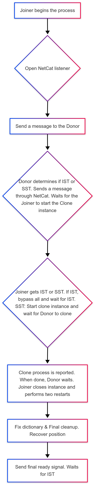

# State Snapshot Transfer (SST) Method using Clone plugin

--8<--- "tech-preview.md:3:3"

## SST Method: Clone

Introduced in Percona XtraDB Cluster (PXC) version 8.4.4-4, Clone SST is a modern and efficient method that leverages MySQL's native cloning capabilities to transfer data from a Donor node to a Joiner node. It is faster and more resource-efficient than traditional methods like xtrabackup or rsync.

## Limitations

Clone limitations are described in [Clone plugin limitations](https://docs.percona.com/percona-server/8.4/clone-plugin-limitations.html)

## Key features

| Feature                 | Description                                                 |
|-------------------------|-------------------------------------------------------------|
| Efficient data transfer | The clone plugin transfers data at the file level, reducing overhead. |
| Consistency            | Ensures data consistency between the donor and Joiner nodes. |
| Minimal Downtime       | Reduces the time required for node synchronization.         |
| Native Integration     | Fully integrated into MySQL, eliminating the need for external tools. |


## Prerequisites

The requirements for enabling SST transfers with the Clone plugin are as follows:

* Percona XtraDB Cluster (PXC) version 8.4.4-4 or later

* Sufficient disk space and network bandwidth for data transfer

* Properly configured PXC cluster with at least one donor node

* NetCat package installed

* The State Snapshot Transfer (SST) process uses port 4444 by default for data transfer between nodes when you use Percona Xtrabackup SST

## Best practices

The following best practices are for using SST with the Clone plugin:

| Recommendation           | Description                                                                                  |
|-------------------------------|--------------------------------------------------------------------------------------------------|
| Choose a Suitable Donor       | Select a Donor node with low load and sufficient resources to avoid performance degradation.     |
| Monitor Resources             | Monitor CPU, memory, and disk usage during the SST process.                                      |
| Test in Staging               | Test the SST process in a staging environment before deploying it in production.                 |

## Process outline

A high-level outline of the process:

<div style="text-align: center;">
  
</div>

## Enable the Clone SST Method

The Clone State Snapshot Transfer (SST) method in Percona XtraDB Cluster allows for efficient data synchronization between nodes. Proper configuration of this method ensures smooth and reliable cluster operations. This section explains how to enable the Clone SST method, including necessary variable settings and SSL configuration for secure data transfer.

### Donor and Joiner

To enable the `clone` SST method, ensure the [`wsrep_sst_allowed_methods`](wsrep-system-index.md#wsrep_sst_allowed_methods) variable in the configuration file (`my.cnf`) includes the `clone` method for both the Donor and Joiner servers. This setting is essential for a successful State Snapshot Transfer (SST).

Starting from Percona XtraDB Cluster 8.4.4-4, the default value of `wsrep_sst_allowed_methods` includes `clone`, which removes the need to configure this option manually in most cases.

```ini
[mysqld]
wsrep_sst_allowed_methods = xtrabackup-v2,clone
```

### Joiner

On the Joiner server, set the [`wsrep_sst_method`](wsrep-system-index.md#wsrep_sst_method) variable to `clone` in the configuration file (`my.cnf`). This setting is the only accepted value for the Clone SST process.

```ini
[mysqld]
wsrep_sst_method = clone
```

### Additional Information

The `wsrep_sst_allowed_methods` and `wsrep_sst_method` variables are read-only and cannot be modified at runtime. You must set them in the configuration file before starting the server. Attempting to change these variables while the server is running will result in errors and may cause inconsistencies during node synchronization operations.

For Percona XtraDB Cluster, any variables related to the SST mechanism, such as `wsrep_sst_allowed_methods` and `wsrep_sst_method`, must be defined before the  server startup to ensure proper synchronization.

## Enable SSL for Clone SST

To enable SSL for the Clone SST process, place the SSL certificates in a directory other than the data directory, as the clone process modifies this directory.

We recommend explicitly setting the SSL certificates in the `my.cnf` file as follows:

```ini
[client]
ssl-ca = /<path>/ca.pem
ssl-cert = /<path>/client-cert.pem
ssl-key = /<path>/client-key.pem

[mysqld]
ssl-ca = /<path>/ca.pem
ssl-cert = /<path>/server-cert.pem
ssl-key = /<path>/server-key.pem
```

Alternatively, you can configure the following SSL settings specifically for the Clone SST process on the Joiner:

```ini
[mysqld]
clone_ssl_ca = /path/to/ca.pem
clone_ssl_cert = /path/to/client-cert.pem
clone_ssl_key = /path/to/client-key.pem
```

Ensure the `<path>` used is not the data directory to avoid conflicts during the Clone SST process.

## Variables

### SST variables

State Snapshot Transfer (SST) in Galera Cluster relies on specific variables that control its configuration and behavior. You must set these variables appropriately to ensure seamless synchronization between nodes during the SST process. The following lists of the most commonly used variables and their purposes.

| Variable                        | Description                                                                                                   | Link                                      |
|---------------------------------|---------------------------------------------------------------------------------------------------------------|-------------------------------------------|
| `sst_idle_timeout`              | Sets the maximum time (in seconds) the SST process can remain idle before being considered failed. You must define this variable in the `[sst]` section of the `my.cnf` file. |  |
| `wsrep_sst_donor`               | Defines the preferred donor node for SST. If not specified, the cluster automatically selects a donor.      | [Learn more](wsrep-system-index.md#wsrep_sst_donor) |
| `wsrep_sst_method`              | Specifies the method or script used for the State Snapshot Transfer (SST) process. Only one value can be selected. | [Learn more](wsrep-system-index.md#wsrep_sst_method) |
| `wsrep_sst_receive_address`     | Specifies the IP address and port on the Joiner node to receive SST data.                                   | [Learn more](wsrep-system-index.md#wsrep_sst_receive_address) |


### Timeout variables

During the Clone SST process, there are three key moments when the Joiner or Donor must wait for the other to complete a specific action. These moments are governed by the following configurable timeout variables:

| Variable                          | Description                                                                                                                                                       |
|-----------------------------------|-------------------------------------------------------------------------------------------------------------------------------------------------------------------|
| `joiner_timeout_wait_donor_message` | Determines how long (in seconds) the Joiner waits for the Donor to respond, indicating whether the action to perform is SST or IST. The default value is 60 seconds, which is usually sufficient. If the timeout is reached, the process aborts. |
| `donor_timeout_wait_joiner`       | Specifies how long (in seconds) the Donor waits for the Joiner to initialize the MySQL instance. The default value is 200 seconds. In slower systems, this value may need to be increased. The Donor log will provide a countdown and indicate if a timeout occurs. If the timeout is reached, the process aborts. |
| `joiner_timeout_clone_instance`    | Sets the time (in seconds) the Joiner waits to detect the MySQL instance where the Clone action will take place. The default value is 90 seconds. If the timeout is reached, the process aborts.             |

These timeout variables can be configured in the `my.cnf` file as follows:

```ini
[sst]
joiner_timeout_wait_donor_message=60
donor_timeout_wait_Joiner=200
joiner_timeout_clone_instance=90
```

## Debug the process

In the same context, if you must debug the process and need more information, you can enable the debug output in my.cnf:

```ini
[sst]
wsrep-debug=true
```

The default port used by the SST process is 4444.

## Monitor the process

The Joiner log reports the clone process as a `% of the data transfer completed`.
The query used is:

```{.bash data-prompt="mysql>"}
mysql>SELECT FORMAT(((data/estimate)*100),2) 'completed%' FROM performance_schema.clone_progress WHERE stage LIKE 'FILE_COPY';```

For more information on the progress, you can also use the query:

`SELECT STATE, ERROR_NO, ERROR_MESSAGE FROM performance_schema.clone_status;`

## Troubleshoot

| Problem | Possible Cause | Solution |
|---------|---------------|----------|
| Clone operation fails | Network interruptions | Ensure stable network connection between nodes and sufficient bandwidth for data transfer |
| Clone operation times out | Insufficient timeout values | Increase the timeout values in the `[sst]` section of my.cnf |
| "No space left on device" error | Insufficient disk space | Verify that both donor and Joiner nodes have at least 1.5x the database size in free disk space |
| Permission denied errors | Incorrect MySQL user privileges | Ensure the MySQL user has CLONE_ADMIN privileges on both nodes |
| Connection refused on port 4444 | Firewall blocking traffic | Check firewall settings to allow traffic on port 4444 between cluster nodes |
| Certificate validation failure | Incorrect SSL configuration | Verify SSL certificates are properly configured and accessible in non-data directories |
| Clone plugin not found | Plugin not installed | Install the clone plugin using `INSTALL PLUGIN clone SONAME 'mysql_clone.so'` |
| Data inconsistency after clone | Interrupted clone process | Check MySQL error logs and restart the clone process |


