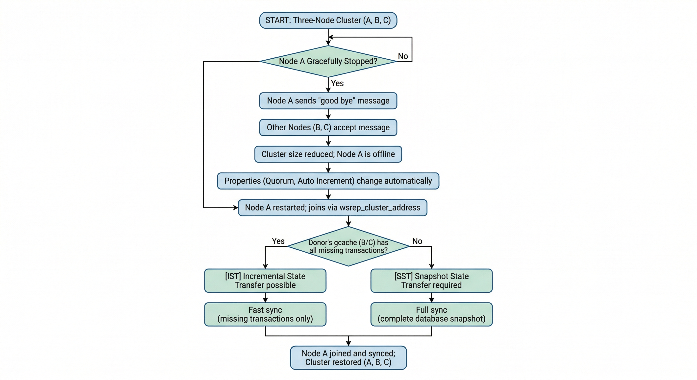
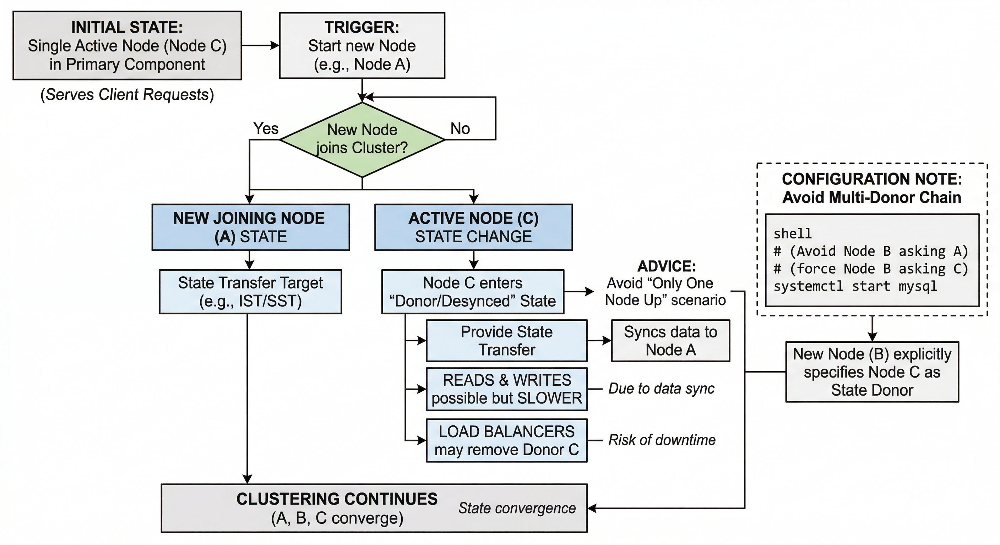
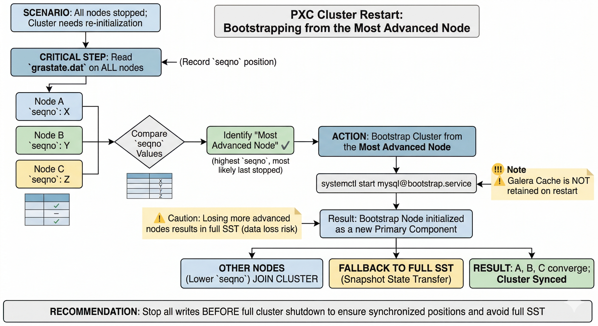
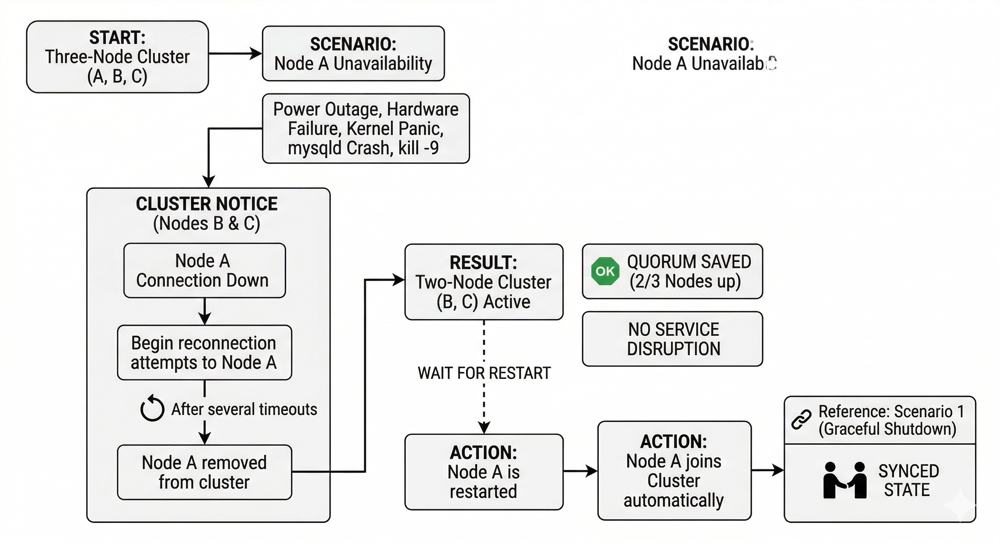
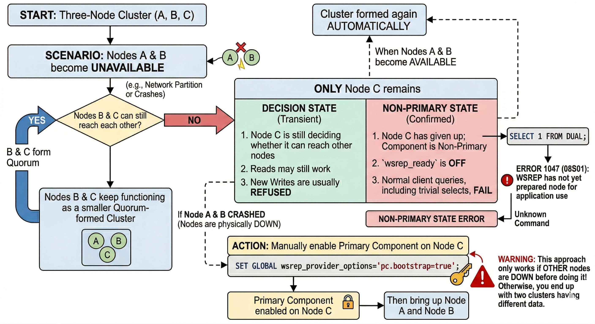
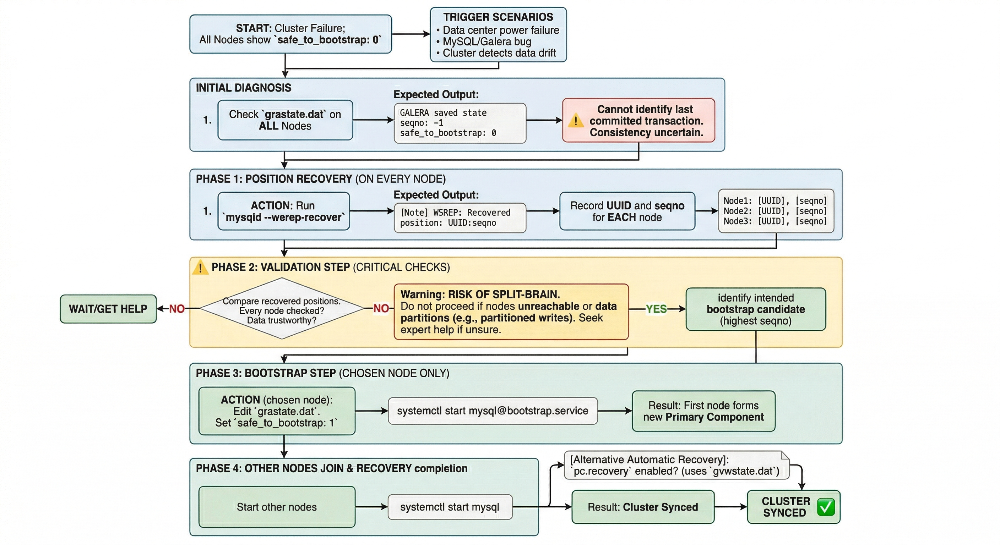
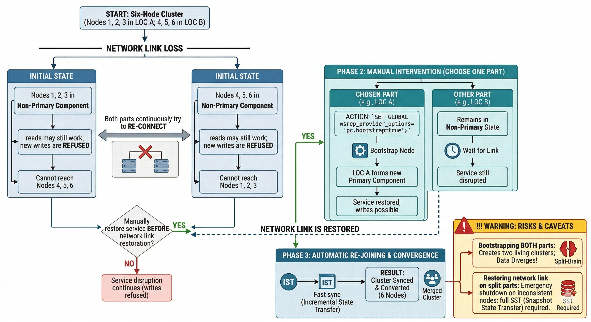

# Crash recovery

Unlike the standard MySQL replication, a PXC cluster acts like one logical entity, which controls the status and consistency of each node as well as the status of the whole cluster. This allows maintaining the data integrity more efficiently than with traditional asynchronous replication without losing safe writes on multiple nodes at the same time.

However, there are scenarios where the database service can stop with no node being able to serve requests.

!!! note "PXC 8.4 and full state transfer"

    When this page says a full [SST](glossary.md#sst), PXC 8.4 usually delivers that with the MySQL Clone plugin if [`wsrep_sst_method`](wsrep-system-index.md#wsrep_sst_method) is `clone`; otherwise the configured method (for example `xtrabackup-v2`) runs. The cluster behavior is the same—a full copy from a donor—only the mechanism differs. See [State Snapshot Transfer (SST) Method using Clone plugin](clone-sst.md) and [SST/Clone failure recovery](sst-clone-failure-recovery.md).

## Scenario 1: Node A is gracefully stopped



In a three node cluster (node A, Node B, node C), one node (node A, for example) is gracefully stopped: for the purpose of maintenance, configuration change, etc.

In this case, the other nodes receive a “good bye” message from the stopped node and the cluster size is reduced; some properties like quorum calculation or auto increment are automatically changed. As soon as node A is started again, it joins the cluster based on its [`wsrep_cluster_address`](wsrep-system-index.md#wsrep_cluster_address) variable in `my.cnf`.

If the writeset cache ([`gcache.size`](wsrep-provider-index.md#gcachesize)) on nodes B and/or C still has all the transactions executed while node A was down, joining is possible via
[IST](glossary.md#ist). If [IST](glossary.md#ist) is impossible due to missing transactions in donor’s gcache, the fallback decision is made by the donor and a full [SST](glossary.md#sst) is started automatically, using whatever SST method is configured (`clone`, `xtrabackup-v2`, and so on).

## Scenario 2: Two nodes are gracefully stopped



Similar to [Scenario 1: Node A is gracefully stopped](#scenario-1-node-a-is-gracefully-stopped), the cluster size is reduced to one — even the single remaining node C forms the primary component and is able to serve client requests. To get the nodes back into the cluster, you just need to start them.

However, when a new node joins the cluster, node C will be switched to the “Donor/Desynced” state as it has to provide the state transfer at least to the first joining node. It is still possible to read/write to it during that process, but it may be much slower, which depends on how large amount of data should be sent during the state transfer. Also, some load balancers may consider the donor node as not operational and remove it from the pool. So, it is best to avoid the situation when only one node is up.

If you restart node A and then node B, you may want to make sure node B does not use node A as the state transfer donor: node A may not have all the needed writesets in its gcache. Specify node C node as the donor in your configuration file and start the mysql service:

```shell
systemctl start mysql
```

!!! admonition "See also"

    [MariaDB Galera Documentation: wsrep_sst_donor option :octicons-link-external-16:](https://mariadb.com/docs/galera-cluster/reference/galera-cluster-system-variables#wsrep_sst_donor)

## Scenario 3: All three nodes are gracefully stopped



The cluster is completely stopped and the problem is to initialize it again. It is important that a PXC node writes its last executed position to the `grastate.dat` file.

If every node shut down cleanly, comparing the `seqno` value in `grastate.dat` is usually enough to pick the most advanced node (most likely the last stopped). If any node might have crashed, been killed, or lost power, do not rely on `grastate.dat` alone: run the [validation step](#validation-step-recover-and-record-position-on-every-node) from Scenario 6 (`mysqld --wsrep-recover`) on every node before you choose the bootstrap candidate.

The cluster must be bootstrapped from the most advanced node (highest `seqno` from `grastate.dat` after a verified clean stop, or highest recovered `seqno` from `mysqld --wsrep-recover` on each node if you used Scenario 6 validation). Otherwise, nodes that held a more advanced position must perform a full [SST](glossary.md#sst) to join a cluster bootstrapped from a less advanced node, and some transactions will be lost. To bootstrap the first node, start the bootstrap systemd template instance. With the usual Percona package layout:

```shell
systemctl start mysql@bootstrap.service
```

If your unit is named `mysqld` instead of `mysql`, use the matching template your packages provide (for example `mysqld@bootstrap.service`).

!!! note

    Even though you bootstrap from the most advanced node, the other nodes have a lower sequence number. They will still need a full [SST](glossary.md#sst) (Clone, xtrabackup-v2, or another configured method) to join because the *Galera Cache* is not retained on restart.
    
    For this reason, it is recommended to stop writes to the cluster *before* its full shutdown, so that all nodes can stop at the same position. See also [`pc.recovery`](wsrep-provider-index.md#pcrecovery).

## Scenario 4: One node disappears from the cluster



This is the case when one node becomes unavailable due to power outage, hardware failure, kernel panic, mysqld crash, kill -9 on mysqld pid, etc.

Two remaining nodes notice the connection to node A is down and start trying to re-connect to it. After several timeouts, node A is removed from the cluster. The quorum is saved (two out of three nodes are up), so no service disruption happens. After it is restarted, node A joins automatically (as described in [Scenario 1: Node A is gracefully stopped](#scenario-1-node-a-is-gracefully-stopped)).

## Scenario 5: Two nodes disappear from the cluster



Two nodes are not available and the remaining node (node C) is not able to form the quorum alone. The cluster has to switch to a non-primary mode. While node C is still deciding whether it can reach the other nodes, reads may still work and new writes are usually refused. Once node C gives up and the component is non-primary, `wsrep_ready` is `OFF` and normal client queries—including trivial selects—fail.

For example:

```sql
SELECT 1 FROM DUAL;
```

??? example "The error message"

    ```{.text .no-copy}
    ERROR 1047 (08S01): WSREP has not yet prepared node for application use
    ```

The SQLSTATE is `08S01`; some builds or code paths may show `ERROR 1047 (08S01): Unknown Command` instead of the longer WSREP text—both are the same class of failure when the node is not prepared for application use.

As soon as the other nodes become available, the cluster is formed again automatically. If node B and node C were just network-severed from node A, but they can still reach each other, they will keep functioning as they still form the quorum.

If node A and node B crashed, you need to enable the primary component on node C manually, before you can bring up node A and node B. The command to do this is:

```sql
SET GLOBAL wsrep_provider_options='pc.bootstrap=YES';
```

`pc.bootstrap=YES` and `pc.bootstrap=true` are equivalent. This approach only works if the other nodes are down before doing that! Otherwise, you end up with two clusters having different data.

!!! admonition "See also"

    [Adding Nodes to Cluster](add-node.md#add-nodes-to-cluster)

## Scenario 6: All nodes went down without a proper shutdown procedure



This scenario is possible in the following cases:

* Data center power failure

* MySQL or Galera bug

* The cluster detects that each node has different data. 

In each of these cases, the `grastate.dat` file is not updated and does not contain a valid sequence number (seqno).

The `grastate.dat` file may look like this. Run:

```shell
cat /var/lib/mysql/grastate.dat
```

??? example "Expected output"

    ```{.text .no-copy}
    GALERA saved state
    version: 2.1
    uuid: 220dcdcb-1629-11e4-add3-aec059ad3734
    seqno: -1
    safe_to_bootstrap: 0
    ```

In this case, you cannot be sure that all nodes are consistent with each other. The `safe_to_bootstrap` variable is set to 0 on every node and cannot be used to identify which node has the last transaction committed.

!!! warning "Risk of split-brain"

    Setting `safe_to_bootstrap: 1` on a node without first confirming that node has the highest recovered position can cause split-brain and data loss. Always run the validation step below on every node and bootstrap only from the node with the highest seqno.

### Validation step: recover and record position on every node

On each node that was part of the cluster, run `mysqld` with the `--wsrep-recover` option so that the server prints the recovered position and exits (the server does not stay running). Use the same option file and privileges you use for production, and run as the account that owns the data directory (often `mysql`), with any running `mysqld` on that node stopped first.

```shell
sudo -u mysql /usr/sbin/mysqld --defaults-file=/etc/mysql/my.cnf --wsrep-recover
```

Adjust `--defaults-file` and the `mysqld` path for your installation (for example `/etc/my.cnf` on RHEL-style layouts, or `mysqld` under `/usr/libexec` on some systems).

In the output, find the line that reports the recovered position in the form `UUID:seqno`:

??? example "Example output"

    ```{.text .no-copy}
    ...
    ... [Note] WSREP: Recovered position: 220dcdcb-1629-11e4-add3-aec059ad3734:1122
    ...
    ```

Run the command on every node and record the UUID and seqno from each. Use a table like the following so that you can compare and choose the correct bootstrap candidate:

| Node (hostname or label) | UUID | seqno |
|--------------------------|------|-------|
| node1                    |      |       |
| node2                    |      |       |
| node3                    |      |       |

!!! warning "When highest seqno is not safe to use"

    The procedure below assumes you have access to every node that was in the cluster and that the recovered positions are trustworthy. If either is false, bootstrapping from the node with the highest seqno can permanently destroy data.

    * Access to all nodes: If a node is unreachable (for example, in another datacenter or still down), you cannot assume the highest seqno you see is the true cluster state. The missing node may have had a higher seqno. Bootstrap only after you have run `mysqld --wsrep-recover` on every member and recorded the result.

    * Trustworthiness of the "highest" node: A node can report a higher seqno but have corrupt or incomplete data—for example, after a partition (it was in a minority and applied writes that were never committed cluster-wide), a write-ahead or disk failure (it reported a seqno that was not fully persisted), or an unclean shutdown. Bootstrapping from that node forces the rest of the cluster to sync to that state. The cluster will then permanently drop or overwrite the transactions that existed only on the other nodes. If you suspect the "highest" node was partitioned, had storage or write-ahead issues, or you cannot verify its history, do not bootstrap from it without expert guidance or a verified backup strategy. Prefer [Get help from Percona](get-help.md) or your support channel when in doubt.

If you have verified all nodes and trust the node with the greatest seqno, that node is the intended bootstrap candidate. If two nodes show the same UUID and seqno, either can be used.

### Bootstrap step: set safe_to_bootstrap and start the first node

Only on the node that has the highest seqno from the validation step (and only after the caveats above are satisfied), set `safe_to_bootstrap` to 1 in that node’s `grastate.dat` file, then bootstrap from that node:

```shell
# On the chosen node only: edit grastate.dat and set safe_to_bootstrap: 1, then:
systemctl start mysql@bootstrap.service
```

If your service name is `mysqld`, use `mysqld@bootstrap.service` (or the unit your package documents).

After a clean shutdown in the future, you can bootstrap from the node which is marked as safe in the `grastate.dat` file (where `safe_to_bootstrap: 1`).

In recent Galera versions, the option [`pc.recovery`](wsrep-provider-index.md#pcrecovery) (enabled by default) saves the cluster state into a file named `gvwstate.dat` on each member node. As the name of this option suggests (pc – primary component), it saves only a cluster being in the PRIMARY state. An example content of the file may look like this:

```{.text .no-copy}
cat /var/lib/mysql/gvwstate.dat
my_uuid: 76de8ad9-2aac-11e4-8089-d27fd06893b9
#vwbeg
view_id: 3 6c821ecc-2aac-11e4-85a5-56fe513c651f 3
bootstrap: 0
member: 6c821ecc-2aac-11e4-85a5-56fe513c651f 0
member: 6d80ec1b-2aac-11e4-8d1e-b2b2f6caf018 0
member: 76de8ad9-2aac-11e4-8089-d27fd06893b9 0
#vwend
```

We can see a three node cluster with all members being up. The nodes will try to restore the primary component once all the members start to see each other. This makes the PXC cluster automatically recover from being powered down without any manual intervention.

The following log excerpt is illustrative (timestamps are examples only):

```{.text .no-copy}
2024-11-08T12:35:05.890123Z 0 [Note] InnoDB: Waiting for purge to start
2024-11-08T12:35:06.901234Z 0 [Note] InnoDB: Purge done
2024-11-08T12:35:07.012345Z 0 [Note] InnoDB: Buffer pool(s) load completed at 2024-11-08T12:35:07.012345Z
2024-11-08T12:35:07.123456Z 0 [Note] WSREP: Ready for connections.
```

## Scenario 7: The cluster loses its primary state due to split brain



We have a six-node cluster. Three of them are in one location while the other three are in another location and they lose network connectivity.  

Best practice is to avoid this topology. If you cannot run an odd number of data nodes, add an arbitrator (`garbd`) or increase `pc.weight` on selected nodes so one side can keep quorum. With an even number, if the split brain happens, neither location can maintain a quorum: both groups must stop serving requests and keep trying to reconnect.

To restore the service before the network link is restored, you can make one of the groups primary again using the same command as described in [Scenario 5: Two nodes disappear from the cluster](#scenario-5-two-nodes-disappear-from-the-cluster)

```sql
SET GLOBAL wsrep_provider_options='pc.bootstrap=YES';
```

After this command, you can work on the partition where you formed a primary again. When the network link returns, the other half can rejoin with [IST](glossary.md#ist) only if it did not execute writes that diverge from the primary you chose (read-only or idle during the partition). If both sides accepted writes, treat the cluster as divergent: plan for a full [SST](glossary.md#sst) or Clone-based rejoin (or restore from backup) for nodes that cannot IST safely; see [SST/Clone failure recovery](sst-clone-failure-recovery.md).

!!! warning

    If you set the bootstrap option on both separated parts, you will have two independent clusters and diverging data. Restoring the network link does not merge them automatically; you must restart nodes and ensure `wsrep_cluster_address` points at a single primary component before the cluster can reunite.

    Galera enforces consistency: when nodes detect conflicting row data, affected nodes may perform an emergency shutdown. Bringing them back into a single cluster usually requires a full [SST](glossary.md#sst) (Clone, xtrabackup-v2, or another configured method) so every node shares the same dataset again.


