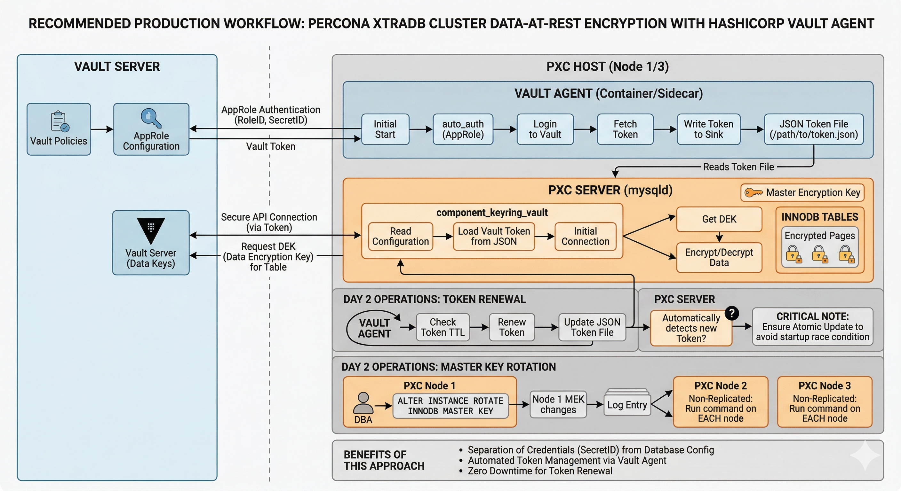

# Data at rest encryption

## Introduction

New to encryption? Start with [Encrypt data for the first time](quickstart-encrypt-data.md).

Ongoing tasks (rotation, backups, runbooks)? See [Operate encrypted PXC clusters](operate-encrypted-pxc-clusters.md).

* [Concepts](#concepts) — keyring, master key, encrypted tablespace.

* [File keyring](#use-the-component_keyring_file) — `component_keyring_file`, manifest, cluster behavior.

* [Vault keyring](#configure-pxc-to-use-component_keyring_vault-component) — `component_keyring_vault` JSON, connectivity, authentication model, failure modes.

* [Mix keyring types](#mix-keyring-component-types) — constraints when nodes use different keyring components.

* [Compliance and audit evidence](#compliance-and-audit-evidence) — who can decrypt, where credentials live, rotation and Vault audit trails.

Data at rest encryption protects data stored on a server disk. An unauthorized user who reads data files on the file system cannot read the contents when encryption is enabled.

Percona XtraDB Cluster {{vers}} inherits from Percona Server for MySQL {{vers}} the ability to enable, disable, and apply encryption to the following objects:



* File-per-tablespace table

* Schema

* General tablespace

* System tablespace

* Temporary table

* Binary log files

* Redo log files

* Undo tablespaces

* Doublewrite buffer files

Transit data moves to another node or client. Encrypted transit data uses a Secure Sockets Layer (SSL) connection.

Percona XtraDB Cluster {{vers}} supports all data at rest encryption features from Percona Server for MySQL {{vers}}.

## Concepts

A keyring stores encryption keys outside user table data. Percona XtraDB Cluster loads a keyring component at startup through a manifest file.

InnoDB uses a master key from the keyring to protect tablespace keys. An encrypted tablespace stores data pages on disk that tablespace keys encrypt.


Without a loaded keyring, encrypted tablespaces cannot open.

## Use the component_keyring_file

### Configuration

Percona XtraDB Cluster inherits Percona Server for MySQL behavior for `component_keyring_file` configuration. The following example shows how to use the component. Review [Use the keyring vault component :octicons-link-external-16:](https://docs.percona.com/percona-server/{{vers}}/use-keyring-vault-component.html) for the latest keyring component information.

!!! note

    Do not use `component_keyring_file` for regulatory compliance.

Install the component with a manifest file. Add the following options to the configuration file:

Create a manifest file named `mysqld.my` in the installation directory:

```{.text .no-copy}
{
 "read_local_manifest": false,
 "components": "file://component_keyring_file"
}
```

Add the following options to the configuration file:

```{.text .no-copy}
[mysqld]
component_keyring_file_data=<PATH>/keyring
```

The `SHOW COMPONENTS` statement checks whether the component loaded:

```sql
SHOW COMPONENTS;
```

??? example "Expected output"

    ```{.text .no-copy}
    +----------------------------------------+
    | Component_id                           |
    +----------------------------------------+
    | file://component_keyring_file          |
    +----------------------------------------+
    ```

!!! note

    PXC recommends the same configuration on all cluster nodes. All nodes should have the keyring configured. A mismatch in keyring configuration blocks the JOINER node from joining the cluster.

When a bootstrapped node has keyring enabled, upcoming cluster nodes inherit the keyring (the encrypted key) from the DONOR node.

#### Usage

XtraBackup re-encrypts the data with a transition key. The JOINER node re-encrypts the data with a master key that the JOINER generates.

The keyring (and the Percona XtraDB Cluster SST process) is backward compatible. A higher-version JOINER can join from a lower-version DONOR. The reverse path is not supported.

Percona XtraDB Cluster does not allow nodes with encryption and nodes without encryption in the same cluster. Mixed encryption states break data consistency. For example, node-1 has encryption (keyring) enabled and node-2 has encryption (keyring) disabled. A table with encryption on node-1 fails on node-2 and causes data inconsistency. A node fails to start when the keyring component fails to load.

!!! note

    When keyring parameters are missing, the node does not load the keyring. The JOINER node may start. The JOINER node shuts down when a Data Manipulation Language (DML) inconsistency with the encrypted tablespace is detected.

When a node has no encrypted tablespace, the keyring file exists but is empty. When an encrypted table is created on that node, the keyring file receives the required encryption keys.

The JOINER node generates a keyring local to the JOINER. InnoDB master key rotation, backups, and cluster operations are covered in [Operate encrypted PXC clusters](operate-encrypted-pxc-clusters.md).
### Compatibility

The Percona XtraDB Cluster SST process with keyring support is backward compatible. A higher-version JOINER can join from a lower-version DONOR. The reverse path is not supported.

## Configure PXC to use component_keyring_vault component

### component_keyring_vault

The `component_keyring_vault` stores the master encryption key in a HashiCorp Vault server. `component_keyring_file` stores the key in a local file instead.

### Configuration

Configuration options are the same as [Percona Server for MySQL :octicons-link-external-16:](https://docs.percona.com/percona-server/{{vers}}/use-keyring-vault-component.html).

Create a manifest file named `mysqld.my` in the installation directory:

```{.text .no-copy}
{
 "read_local_manifest": false,
 "components": "file://component_keyring_vault"
}
```

Create a configuration file `component_keyring_vault.cnf` in JSON format:

```{.text .no-copy}
{
 "timeout": 15,
 "vault_url": "https://vault.public.com:8202",
 "secret_mount_point": "secret",
 "secret_mount_point_version": "AUTO",
 "token": "{randomly-generated-alphanumeric-string}",
 "vault_ca": "/data/keyring_vault_confs/vault_ca.crt"
}
```

The `secret_mount_point_version` parameter defaults to `AUTO`. The parameter controls whether the Vault Key-Value (KV) Secrets Engine is version 1 (kv) or version 2 (kv-v2). The wrong KV version can cause silent failures during keyring operations.

After `mysqld` starts with the manifest and JSON in place, confirm the component:

```sql
SHOW COMPONENTS;
```

??? example "Expected outcome"

    ```{.text .no-copy}
    +----------------------------------------+
    | Component_id                           |
    +----------------------------------------+
    | file://component_keyring_vault         |
    +----------------------------------------+
    ```

!!! warning

    Token security: avoid long-lived tokens in configuration files. Consider [Vault AppRole authentication :octicons-link-external-16:](https://developer.hashicorp.com/vault/docs/auth/approle) or dynamic token retrieval for stronger security.

The keyring vault component options are described in [Percona Server for MySQL keyring vault component documentation :octicons-link-external-16:](https://docs.percona.com/percona-server/{{vers}}/use-keyring-vault-component.html).

Vault server is an external server. Ensure the PXC node can reach the server.

### Typical Vault layout (what most teams run)

The usual pattern is a highly available (HA) Vault cluster in each environment. For example, use a three-node Raft cluster or a Consul-backed cluster. Expose the cluster to database hosts as one logical endpoint. Use a DNS name or load-balanced virtual IP (VIP) in `vault_url`. All PXC nodes talk to that shared Vault infrastructure.

Percona keyring still requires each `mysqld` instance to have its own `secret_mount_point` namespace. Do not point two servers at the same mount point. A common compromise uses the same Vault cluster and KV engine with different mount paths or sub-paths per node. For example, use `pxc-prod/node1` and `pxc-prod/node2` so policies stay simple and keys never collide.

Less common: one standalone Vault per database host (higher operational load). Multi-region setups replicate Vault data or run a Vault cluster per region. Database hosts in a region use the regional `vault_url`.

### Authentication lifecycle

The credential in `component_keyring_vault.cnf` is the Vault `token` field. Operational runbooks sometimes call this field `vault_token`. Vault tokens are not indefinite. Each token carries a Time-To-Live (TTL) and expires unless renewed or replaced. When the token expires, the keyring component can no longer read or write keys in Vault. The server may fail to open encrypted tablespaces or fail to start.

#### What the server does not do

`component_keyring_vault` reads a bearer token string from JSON configuration and calls the Vault HTTP API. The keyring component does not implement AppRole login, Kubernetes auth, LDAP, or any other Vault authentication method. The keyring component does not renew tokens on a schedule.

The legacy keyring Vault plugin in older releases behaved the same way at the token layer. The server expected a usable token in configuration rather than multi-step Vault login flows.

PXC {{vers}} uses the keyring component model only. The keyring plugin is not supported in {{vers}} (see [Upgrade guide](upgrade-guide.md#keyring-plugin-vs-keyring-component)). Regardless of plugin or component, the deployment must supply a valid token string through external automation.

#### Minimum external automation

The server does not refresh Vault credentials by itself. Run at least one of the following on each database host. You can also deliver an equivalent outcome through your platform:

* [Vault Agent :octicons-link-external-16:](https://developer.hashicorp.com/vault/docs/agent-and-proxy/agent) with `auto_auth` (AppRole, AWS, or another method) and a `sink` or `template` that writes a fresh token before the current token TTL ends

* A scheduled job (for example, `cron`) plus the Vault CLI or API client that logs in, fetches a new token, and updates the JSON the keyring reads. Follow with `ALTER INSTANCE RELOAD KEYRING` or a controlled `mysqld` restart on that host so the running server picks up the file (see [Apply an updated token on a running server](operate-encrypted-pxc-clusters.md#apply-an-updated-token-on-a-running-server)).

Without one of those patterns (or a custom sidecar with the same effect), long-lived static tokens eventually expire and the cluster loses access to keys.


For token reload, AppRole setup, startup order, and disaster recovery procedures, see [Vault keyring operations](operate-encrypted-pxc-clusters.md#vault-keyring-operations).

!!! warning

    SST limitation: the rsync tool does not support `component_keyring_vault`. Any rsync SST on a joiner aborts when `component_keyring_vault` is configured.

Uniform component configuration: Percona XtraDB Cluster strongly recommends the same keyring component type on all cluster nodes. Mix keyring component types only during controlled transitions from `component_keyring_file` to `component_keyring_vault` or the reverse. Inconsistent keyring configurations can lead to data inconsistency and cluster instability.

All nodes do not need to refer to the same Vault server. Whatever Vault server is used, the server must be accessible from the respective node. All nodes do not need to use the same mount point.

When the node cannot reach or connect to the Vault server, an error is notified during server restart. The node refuses to start:

??? example "The warning message"

    ```{.text .no-copy}
    2018-05-29T03:54:33.859613Z 0 [Warning] Component component_keyring_vault reported:
    'There is no vault_ca specified in component_keyring_vault's configuration file.
    Please make sure that Vault's CA certificate is trusted by the machine
    from which you intend to connect to Vault.'
    2018-05-29T03:54:33.977145Z 0 [ERROR] Component component_keyring_vault reported:
    'CURL returned this error code: 7 with error message : Failed to connect
    to 127.0.0.1 port 8200: Connection refused'
    ```

When Vault server connectivity issues occur, only the affected nodes fail to start. For example, node-1 can connect to the Vault server but node-2 cannot. Only node-2 refuses to start.

When a server has encrypted objects but cannot connect to the Vault server during restart, those encrypted objects become inaccessible.

When the Vault server is reachable but authentication credentials are incorrect, the same behavior occurs:

??? example "The warning message"

    ```{.text .no-copy}
    2018-05-29T03:58:54.461911Z 0 [Warning] Component component_keyring_vault reported:
    'There is no vault_ca specified in component_keyring_vault's configuration file.
    Please make sure that Vault's CA certificate is trusted by the machine
    from which you intend to connect to Vault.'
    2018-05-29T03:58:54.577477Z 0 [ERROR] Component component_keyring_vault reported:
    'Could not retrieve list of keys from Vault. Vault has returned the
    following error(s): ["permission denied"]'
    ```

When the Vault server is accessible but the mount point is wrong, no error appears during server restart. The node still refuses to start:

```sql
CREATE TABLE t1 (c1 INT, PRIMARY KEY pk(c1)) ENCRYPTION='Y';
```

??? example "Expected output"

    ```{.text .no-copy}
    ERROR 3185 (HY000): Can't find master key from keyring, please check keyring
    component is loaded.
    ... [ERROR] Component component_keyring_vault reported: 'Could not write key to Vault. ...
    ... [ERROR] Component component_keyring_vault reported: 'Could not flush keys to keyring'
    ```

#### Vault unavailable at restart: no persistent local key cache

`component_keyring_vault` stores key material in HashiCorp Vault for the configured `secret_mount_point`. Vault Agent on the database host renews the bearer token. That addresses token expiry, not loss of network reachability to Vault when the server must load keys from scratch.

On a cold `mysqld` start, the component expects to reach `vault_url` with a valid token. Encrypted tablespaces can then obtain master key data from Vault. When Vault is down, firewalled, or partitioned away at that moment, startup typically fails or encrypted objects do not open. The log excerpts in this section show common connection and permission errors. State held in memory by a previous `mysqld` process does not survive process exit. The Vault component has no separate documented mode that keeps a durable on-disk copy of those keys so the instance can boot while Vault is temporarily unavailable. [`component_keyring_file`](#use-the-component_keyring_file) stores keys in a local keyring file the server reads without a remote service.

Operational implication: plan HA Vault, network paths, and restart sequencing so nodes that use `component_keyring_vault` can reach Vault when they bootstrap. Running instances may continue to serve data that was already decrypted while memory is warm, until an operation forces a Vault round-trip. That behavior does not replace Vault availability for restarts. See [Vault endpoint unreachable while `mysqld` is still running](operate-encrypted-pxc-clusters.md#vault-endpoint-unreachable-while-mysqld-is-still-running).

### Disaster recovery considerations

!!! warning

    Vault as a control plane for data access: with `component_keyring_vault`, the Vault service and the network path to Vault become a single point of failure for access to encrypted data. When Vault is unavailable, nodes may refuse to start or cannot decrypt tablespaces even though data files on disk are intact. High availability, monitoring, and disaster recovery planning for Vault are as important as planning for the database tier.

For backup scope, restore drills, and recovery procedures, see [Disaster recovery](operate-encrypted-pxc-clusters.md#disaster-recovery) in [Operate encrypted PXC clusters](operate-encrypted-pxc-clusters.md).

## Compliance and audit evidence

Regulatory and internal risk frameworks differ. The following list maps common review questions to PXC-relevant artifacts. For algorithms, encrypted object types, and Percona Server semantics, use [Percona Server for MySQL: InnoDB data encryption :octicons-link-external-16:](https://docs.percona.com/percona-server/{{vers}}/data-at-rest-encryption.html) and related upstream manuals.

Who can decrypt data (evidence to maintain):

* A matrix of roles (database, platform, security, backup operations) against the controls they touch: manifest and `my.cnf` for the keyring component; path to `component_keyring_file_data` or to `component_keyring_vault.cnf`; Vault policies and mounts for `secret_mount_point`; OS users that run `mysqld`, Vault Agent, XtraBackup, or configuration management; MySQL accounts with `ENCRYPTION_KEY_ADMIN`, backup-related dynamic privileges, or table read access. Auditors usually want named responsibilities and change approval paths, not a second copy of InnoDB internals.

Where tokens and secrets live (evidence to maintain):

* A written list of every path that can hold a Vault token, AppRole `role_id`, AppRole `secret_id`, or rendered JSON the keyring reads

* The automation that writes each file

* File permissions and the owning user or group for each file

* Policy that long-lived secrets do not live in application source repositories

Compare the record with [Authentication lifecycle](#authentication-lifecycle) and [AppRole Secret ID lifecycle](operate-encrypted-pxc-clusters.md#approle-secret-id-lifecycle).

Rotation and database-side logs (evidence to maintain):

* Change records for rolling `ALTER INSTANCE ROTATE INNODB MASTER KEY` (and GCache rotation if used) that list each host, time window, executor, and outcome; excerpts from the MySQL error log around each rotation; optional query output from [verification checklists](operate-encrypted-pxc-clusters.md#verification-checklists). When binary logging is enabled on a writer, rotation can appear in the binary log for downstream consumers. Your evidence set should match how you treat replicated DDL. See [Replication and cluster behavior](operate-encrypted-pxc-clusters.md#replication-and-cluster-behavior).

Vault audit and API access (evidence to maintain):

* Whether [Vault audit devices :octicons-link-external-16:](https://developer.hashicorp.com/vault/docs/audit) are enabled, where audit logs are stored, retention, and who can read them; sample correlation between a maintenance window and keyring traffic (HTTP paths, policies, status codes). The [After a Vault or network drill](operate-encrypted-pxc-clusters.md#after-a-vault-or-network-drill) checklist already asks teams to validate audit expectations after a controlled test.

Backups and restore custody (evidence to maintain):

* Backup schedules, retention, locations, and which roles can read backup media plus any backup-only Vault token or `component_keyring_vault.cnf` used by XtraBackup. See [Backups and restore for encrypted clusters](operate-encrypted-pxc-clusters.md#backups-and-restore-for-encrypted-clusters).

## Mix keyring component types

XtraBackup introduces transition-key logic. You can mix keyring components. For example, node-1 can use `component_keyring_file` while node-2 uses `component_keyring_vault`.

!!! warning

    Percona strongly recommends the same keyring component configuration for all cluster nodes. Mix keyring component types only during controlled transitions from one keyring type to another. Inconsistent configurations can cause data corruption and cluster failures.
!!! admonition "See also"

    [Operate encrypted PXC clusters](operate-encrypted-pxc-clusters.md)

    [Encrypt traffic documentation](encrypt-traffic.md)

    [GCache and Write-Set cache encryption](gcache-write-set-cache-encryption.md)

    [Percona XtraBackup SST configuration](xtrabackup-sst.md#percona-xtrabackup-sst-configuration)

    [Upgrade Percona XtraDB Cluster — Keyring plugin versus keyring component](upgrade-guide.md#keyring-plugin-vs-keyring-component)

    [Percona Server for MySQL: InnoDB data encryption :octicons-link-external-16:](https://docs.percona.com/percona-server/{{vers}}/data-at-rest-encryption.html)

    [Percona Server for MySQL: Use the keyring vault component :octicons-link-external-16:](https://docs.percona.com/percona-server/{{vers}}/use-keyring-vault-component.html)

    [Percona XtraBackup: Connection and privileges :octicons-link-external-16:](https://docs.percona.com/percona-xtrabackup/{{vers}}/privileges.html)

    [MySQL Reference Manual: Keyring component installation :octicons-link-external-16:](https://dev.mysql.com/doc/refman/{{vers}}/en/keyring-component-installation.html)
