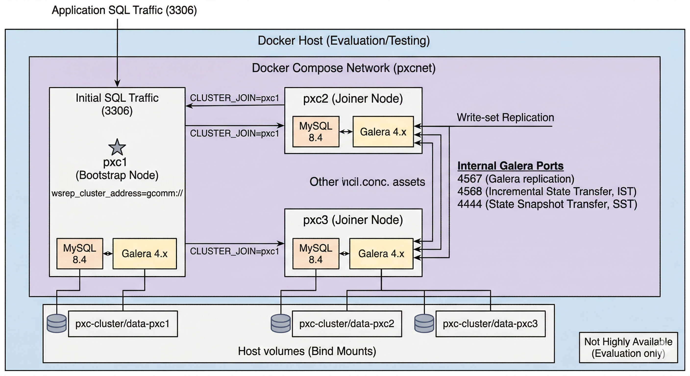

# Run with Docker Compose

For more information about using Docker, see the [Docker Docs :octicons-link-external-16:](https://docs.docker.com/). Use the latest version of Docker. Versions provided through `apt` and `yum` may be outdated and cause errors.

Percona collects [Telemetry data](telemetry.md) in the Percona packages and Docker images.

--8<--- "get-help-snip.md"

This guide describes how to deploy a three-node Percona XtraDB Cluster (PXC) 9.7 with Docker Compose. You generate SSL certificates on the first node. You then copy the certificates to the other two nodes to enable secure communication.



The following procedure is for evaluation and testing only. The MySQL certificates generated here are self-signed. For production, generate and store proper certificates. Also configure storage, [secure networking](secure-network.md), backup, and [monitoring](monitoring.md).

!!! warning "Single-host deployment limits availability"

    This guide runs all three nodes on a single host, which is not highly available. If the host reboots or the disk fails, the entire cluster fails and data can be lost. For production, run each of the three nodes on different physical machines or distinct failure domains. Use scheduling such as Docker Swarm or Kubernetes with anti-affinity to prevent a single failure from taking out the cluster. For production guidance, see [High availability](high-availability.md).

## Prerequisites

The deployment requires the following:

* Docker and Docker Compose installed (or Podman 4.1 or later and Podman Compose; see [Appendix: Podman alternative](#appendix-podman-alternative))

* At least 3 GB of memory per container. Percona XtraDB Cluster requires substantial memory. Without enough RAM, the Out-of-Memory (OOM) killer can terminate the MySQL process during startup or during the State Snapshot Transfer (SST). The cluster can then fail or restart in a loop. Allocate enough free RAM for three nodes plus overhead (for example, at least 10 GB total). The example Compose file sets a 3 GB limit per container. If the host has more RAM, increase the limit accordingly.

* Familiarity with Docker volumes and networks

## Directory structure

Create a directory structure to organize configuration, certificate files, and the Docker Compose definition.

Run the following commands to create the directory structure:

```shell
mkdir -p pxc-cluster/{certs,conf.d,init}
cd pxc-cluster
```

Expected result: No output. The current directory is `pxc-cluster` with subdirectories `certs`, `conf.d`, and `init`.

After you run these commands, the `pxc-cluster/` working directory contains the following layout:

```text
pxc-cluster/
├── certs/
├── conf.d/
└── init/
```

The directory structure separates configuration files, TLS/SSL certificates, and initialization scripts.

## Configuration files

1. Create `conf.d/custom.cnf` with minimal SSL settings:

    ```ini
    [mysqld]
    ssl-ca=/etc/mysql/certs/ca.pem
    ssl-cert=/etc/mysql/certs/server-cert.pem
    ssl-key=/etc/mysql/certs/server-key.pem
    ```

2. Configure password storage with Docker Secrets or `.env`.

    A `.env` file is convenient but exposes secret values through `docker inspect` and process listings. Prefer Docker Secrets (or Podman secrets), which mount passwords as files instead of environment variables.

    Option A — Docker Secrets (recommended): Create two secret files in the project root. Each file must contain only the password with no trailing newline. Generate strong passwords and write them in one step:

    ```shell
    openssl rand -base64 24 | tr -d '\n' > mysql_root_password
    openssl rand -base64 24 | tr -d '\n' > xtrabackup_password
    chmod 600 mysql_root_password xtrabackup_password
    ```

    Each file contains a single line with no trailing newline:

    * `mysql_root_password` — the MySQL root password.

    * `xtrabackup_password` — the XtraBackup replication password.

    Add `mysql_root_password` and `xtrabackup_password` to your `.gitignore`. The Compose file in [Docker Compose setup](#docker-compose-setup) references these files through the `secrets:` block. The container reads passwords from the mounted files through `MYSQL_ROOT_PASSWORD_FILE` and `XTRABACKUP_PASSWORD_FILE`. The Percona XtraDB Cluster 9.7 image supports these `_FILE` variables. If your image does not support `_FILE` variables, use Option B.

    Option B — `.env` (quick local test only): Create a file named `.env` in the directory root with the following contents:

    ```text
    MYSQL_ROOT_PASSWORD=<password>
    XTRABACKUP_PASSWORD=<password>
    ```

    Add `.env` to your `.gitignore`. In the Compose file, replace the `secrets` block and the `_FILE` variables with `MYSQL_ROOT_PASSWORD=${MYSQL_ROOT_PASSWORD}` and `XTRABACKUP_PASSWORD=${XTRABACKUP_PASSWORD}`.

## SSL certificate generation

For broader guidance on protecting cluster traffic, see [Encrypt traffic](encrypt-traffic.md).

1. Copy the SSL certificate generation script. Save the script as `init/create-ssl-certs.sh`:

    ```bash
    #!/bin/bash
    set -e
    CERT_DIR=./certs
    mkdir -p "$CERT_DIR"
    cd "$CERT_DIR"
    # Generate CA key and certificate
    openssl genrsa -out ca-key.pem 2048
    openssl req -new -x509 -nodes -days 3650 \
        -key ca-key.pem \
        -subj "/C=XX/ST=State/L=City/O=Organization/CN=RootCA" \
        -out ca.pem
    # Generate server key and CSR
    openssl req -newkey rsa:2048 -nodes \
        -keyout server-key.pem \
        -subj "/C=XX/ST=State/L=City/O=Organization/CN=pxc-node" \
        -out server-req.pem
    # Sign server certificate with CA
    openssl x509 -req -in server-req.pem -days 3650 \
        -CA ca.pem -CAkey ca-key.pem -set_serial 01 \
        -out server-cert.pem
    # Restrict permissions
    chmod 600 *.pem
    ```

2. Make the script executable:

    ```shell
    chmod +x init/create-ssl-certs.sh
    ```

    Expected result: No output.

3. Run the script to create the certs:

    ```shell
    ./init/create-ssl-certs.sh
    ```

    Expected result: No output. The script creates `ca-key.pem`, `ca.pem`, `server-key.pem`, `server-req.pem`, and `server-cert.pem` in `certs/`.

    !!! warning

        To regenerate certificates, delete the `certs/` directory first, then run the script again. Running the script twice without removing existing files can fail or overwrite keys, breaking trust across nodes already joined to the cluster.

    !!! note

        The certificates expire in 10 years. For production environments, implement certificate rotation and expiration monitoring.

4. Copy certificates to all nodes (only for multi-host).

    All three nodes must use the same set of SSL certificates. The `docker-compose.yml` in this guide mounts the same `./certs` directory for all three services (pxc1, pxc2, pxc3). For a single-host deployment, all nodes share the `certs/` directory created in step 3.

    For a multi-host deployment, copy the certificates to each machine. Each host must have its own `certs/` directory (or equivalent path) for its Compose project. From node 1, run the following commands:

    ```shell
    scp -r ./certs/ user@node2-host:/path/to/pxc-cluster/certs
    scp -r ./certs/ user@node3-host:/path/to/pxc-cluster/certs
    ```

    Expected result: Progress or confirmation for each file copied to each host. No output indicates success after the transfer completes.

    Ensure each host's Compose file mounts that host's certificate directory. See [Multi-host deployment](#multi-host-deployment) for firewall, name resolution, and time synchronization.

## Multi-host deployment

When you run each node on a separate machine, configure the following on every host in addition to copying certificates.

### Firewall

Allow cluster and client traffic between hosts. Open the following ports on each host for the other hosts' IP addresses or subnet:

* 3306 (MySQL client)

* 4444 (Percona XtraBackup snapshot transfer)

* 4567 (Galera replication)

* 4568 (Galera incremental state transfer)

### Name resolution and CLUSTER_JOIN

Containers on one host must reach containers on other hosts by hostname or IP address. The example Compose file uses `CLUSTER_JOIN=pxc1`, which works only when all containers run on the same host. The name `pxc1` resolves only inside the host network where that container runs.

For a multi-host deployment, set `CLUSTER_JOIN` to the IP address or Fully Qualified Domain Name (FQDN) of the host that runs the bootstrap node. On the hosts that run pxc2 and pxc3, set one of the following:

* `CLUSTER_JOIN=<IP_OF_NODE_1>`

* `CLUSTER_JOIN=<FQDN_OF_NODE_1>`

Replace the placeholder with the actual IP address or FQDN of the machine where pxc1 runs. Add Domain Name System (DNS) records or `/etc/hosts` entries on each host so that the value resolves to the correct machine.

### Time synchronization

Percona XtraDB Cluster and Galera require consistent time across nodes. Synchronize the clock on every host with a Network Time Protocol (NTP) implementation such as `chrony` or `systemd-timesyncd`. Clock skew between hosts can cause replication issues and cluster instability. Enable and run NTP before starting the cluster.

## Docker Compose setup

1. Create `docker-compose.yml`.

    The following example uses Docker Secrets (Option A in [Configuration files](#configuration-files)). If you chose the `.env` option (Option B), make these changes:

    * Remove the top-level `secrets:` block.

    * Remove each service's `secrets:` list.

    * Replace the `_FILE` variables with `MYSQL_ROOT_PASSWORD=${MYSQL_ROOT_PASSWORD}` and `XTRABACKUP_PASSWORD=${XTRABACKUP_PASSWORD}`.

    !!! warning

        If the host runs out of memory, the cluster can fail. Ensure the host has at least enough free RAM for three nodes plus overhead (for example, 10 GB total). The following example sets a 3 GB memory limit per container. The daemon does not start a container when the host cannot satisfy the limit. If the host has more RAM, increase the limit (for example, 4G per container for a 12 GB+ host).

    !!! note "Memory limits with Podman Compose"

        Docker Compose v2 (the `docker compose` plugin) honors the `deploy.resources.limits.memory` block shown below. `podman-compose` and legacy `docker-compose` v1 ignore the `deploy:` block. If you run the stack with `podman compose` or `podman-compose` and need an enforced memory limit, replace the `deploy.resources.limits.memory` block on each service with `mem_limit: 3g` at the service level.

    ```yaml
    secrets:
      mysql_root_password:
        file: ./mysql_root_password
      xtrabackup_password:
        file: ./xtrabackup_password
    services:
      pxc1:
        image: percona/percona-xtradb-cluster:9.7
        container_name: pxc1
        environment:
          - MYSQL_ROOT_PASSWORD_FILE=/run/secrets/mysql_root_password
          - CLUSTER_NAME=pxc-cluster
          - XTRABACKUP_PASSWORD_FILE=/run/secrets/xtrabackup_password
        secrets:
          - mysql_root_password
          - xtrabackup_password
        volumes:
          - ./certs:/etc/mysql/certs:ro,Z
          - ./conf.d:/etc/percona-xtradb-cluster.conf.d:ro,Z
          - ./data-pxc1:/var/lib/mysql,Z
        networks:
          - pxcnet
        ports:
          - "3306:3306"
        command: ["--wsrep-new-cluster"]
        deploy:
          resources:
            limits:
              memory: 3G
        healthcheck:
          test: ["CMD", "mysqladmin", "ping", "-h", "localhost"]
          interval: 10s
          timeout: 5s
          retries: 5
      pxc2:
        image: percona/percona-xtradb-cluster:9.7
        container_name: pxc2
        environment:
          - MYSQL_ROOT_PASSWORD_FILE=/run/secrets/mysql_root_password
          - CLUSTER_NAME=pxc-cluster
          - CLUSTER_JOIN=pxc1
          - XTRABACKUP_PASSWORD_FILE=/run/secrets/xtrabackup_password
        secrets:
          - mysql_root_password
          - xtrabackup_password
        volumes:
          - ./certs:/etc/mysql/certs:ro,Z
          - ./conf.d:/etc/percona-xtradb-cluster.conf.d:ro,Z
          - ./data-pxc2:/var/lib/mysql,Z
        networks:
          - pxcnet
        depends_on:
          pxc1:
            condition: service_healthy
        deploy:
          resources:
            limits:
              memory: 3G
        healthcheck:
          test: ["CMD", "mysqladmin", "ping", "-h", "localhost"]
          interval: 10s
          timeout: 5s
          retries: 5
      pxc3:
        image: percona/percona-xtradb-cluster:9.7
        container_name: pxc3
        environment:
          - MYSQL_ROOT_PASSWORD_FILE=/run/secrets/mysql_root_password
          - CLUSTER_NAME=pxc-cluster
          - CLUSTER_JOIN=pxc1
          - XTRABACKUP_PASSWORD_FILE=/run/secrets/xtrabackup_password
        secrets:
          - mysql_root_password
          - xtrabackup_password
        volumes:
          - ./certs:/etc/mysql/certs:ro,Z
          - ./conf.d:/etc/percona-xtradb-cluster.conf.d:ro,Z
          - ./data-pxc3:/var/lib/mysql,Z
        networks:
          - pxcnet
        depends_on:
          pxc1:
            condition: service_healthy
        deploy:
          resources:
            limits:
              memory: 3G
        healthcheck:
          test: ["CMD", "mysqladmin", "ping", "-h", "localhost"]
          interval: 10s
          timeout: 5s
          retries: 5
    networks:
      pxcnet:
        driver: bridge
    ```

    Volume persistence: The example uses bind mounts (`./data-pxc1`, `./data-pxc2`, `./data-pxc3`). Data lives on the host and survives `docker compose down`. For production, consider named volumes. Named volumes let the runtime manage storage instead of tying data to a single host path. Without bind mounts or named volumes, database data is ephemeral and is lost when containers are removed.

    SELinux and rootless: The example uses `:Z` (or `:z`) on all volume mounts. The runtime relabels them for the container. SELinux relabeling is required when SELinux is enabled. SELinux ships enabled on RHEL, CentOS Stream, Rocky, AlmaLinux, and Fedora. Rootless runtimes (Podman or Docker rootless) also commonly need relabeling. Without relabeling, the container cannot read `certs/`, `conf.d/`, or the data directories and fails at startup. On systems without SELinux, remove `,Z` from the volume suffixes. For more on SELinux configuration, see [SELinux](selinux.md).

## Deployment

1. Start the cluster.

    The Compose file sets `depends_on: pxc1: condition: service_healthy` for pxc2 and pxc3. The join nodes start only after pxc1 passes its healthcheck. This dependency prevents a race where the join nodes start before the bootstrap node is ready. Choose one of the following approaches:

    * Run `docker compose up -d` once. Compose starts pxc1, waits for the healthcheck to pass, then starts pxc2 and pxc3.

    * Start pxc1 first, then start the other nodes after pxc1 reports healthy. The following commands show this approach.

    Start node 1 to initialize the cluster:

    ```shell
    docker compose up -d pxc1
    ```

    Expected result: A line such as `[+] Running 1/1 - Container pxc1  Started`. The container pxc1 is running.

    With Podman, use `podman compose up -d pxc1` or `podman-compose up -d pxc1`.

    Wait for pxc1 to report healthy before starting pxc2 and pxc3. The bootstrap node must accept connections, or the other nodes can fail to join. Use a wait loop:

    ```shell
    until docker exec pxc1 mysqladmin ping -h localhost &>/dev/null; do
      echo "Waiting for pxc1..."
      sleep 2
    done
    ```

    Expected result: The loop prints `Waiting for pxc1...` until the node responds, then exits with no further output.

    Start the remaining nodes:

    ```shell
    docker compose up -d pxc2 pxc3
    ```

    Expected result: Lines such as `[+] Running 2/2 - Container pxc2  Started - Container pxc3  Started`. Both containers are running.

    With Podman, use `podman compose up -d pxc2 pxc3` or `podman-compose up -d pxc2 pxc3`.

## Validation

1. Validate the cluster.

    Check the status of each node from the host. Pass the root password according to your secret store:

    * Docker Secrets: `-p$(cat mysql_root_password)`

    * `.env`: `-p${MYSQL_ROOT_PASSWORD}`

    First, verify cluster size and node status:

    ```shell
    docker exec pxc1 mysql -uroot -p$(cat mysql_root_password) -e "SHOW STATUS LIKE 'wsrep_cluster_size';"
    docker exec pxc2 mysql -uroot -p$(cat mysql_root_password) -e "SHOW STATUS LIKE 'wsrep_cluster_status';"
    ```

    Expected result: `wsrep_cluster_size` returns a row with value `3`. `wsrep_cluster_status` returns `Primary`. If the value is `non-Primary`, the node is isolated.

    Verify additional cluster health indicators on any node (for example, pxc1):

    ```shell
    docker exec pxc1 mysql -uroot -p$(cat mysql_root_password) -e "SHOW STATUS LIKE 'wsrep_ready';"
    docker exec pxc1 mysql -uroot -p$(cat mysql_root_password) -e "SHOW STATUS LIKE 'wsrep_connected';"
    docker exec pxc1 mysql -uroot -p$(cat mysql_root_password) -e "SHOW STATUS LIKE 'wsrep_local_state_comment';"
    ```

    Expected result: `wsrep_ready` = `ON`, `wsrep_connected` = `ON`, `wsrep_local_state_comment` = `Synced`.

    With Podman, use `podman exec` instead of `docker exec`.

All three nodes are joined and synchronized when the listed health indicators show the expected values. To validate replication end-to-end, see [Verify replication](verify-replication.md).

## Backup

Back up data before major changes or shutdown. The following example dumps all databases from pxc1 to a file on the host. Use the root password from your secret file or `.env`:

```shell
docker exec pxc1 mysqldump -uroot -p$(cat mysql_root_password) --all-databases > backup.sql
```

Expected result: The file `backup.sql` is created in the current directory with SQL statements for all databases. If you use `.env`, substitute `-p${MYSQL_ROOT_PASSWORD}`. With Podman, use `podman exec` instead of `docker exec`.

## Troubleshooting

View container logs for debugging:

```shell
docker compose logs -f pxc1
docker compose logs -f pxc2
docker compose logs -f pxc3
```

Each command streams that container's logs (stdout and stderr). The `-f` option follows the log output. Omit `-f` for a one-off dump.

Expected result: Log lines from MySQL and PXC until you press Ctrl+C.

With Podman, use `podman compose logs -f pxc1`.

The following sections cover common issues.

### Containers exit or fail to start

* Symptom: One or more containers exit immediately or fail to reach the healthy state.

* Diagnosis: Check the container logs with `docker compose logs pxc1` (and `pxc2`, `pxc3`).

* Solution: Ensure the bootstrap node (pxc1) is healthy before starting pxc2 and pxc3.

### Cluster size stays at 1

* Symptom: `wsrep_cluster_size` returns `1` instead of `3`.

* Diagnosis: The join nodes started before pxc1 became ready.

* Solution: Start pxc1 first. Wait for the healthcheck to pass. Restart pxc2 and pxc3 after pxc1 is up.

### Permission denied on certs or config

* Symptom: The container fails to read `certs/` or `conf.d/`.

* Diagnosis: SELinux blocks the container from accessing host paths without relabeling.

* Solution: Add `:Z` or `:z` to all volume mounts. See the SELinux note in [Docker Compose setup](#docker-compose-setup) and [Appendix: Podman alternative](#appendix-podman-alternative).

### Nodes cannot reach each other

* Symptom: Galera reports nodes as unreachable, or the cluster size remains `1`.

* Diagnosis: Network configuration prevents nodes from communicating.

* Solution: On a single host, verify all containers are on the same network with `docker network inspect pxc-cluster_pxcnet`. On multiple hosts, see [Multi-host deployment](#multi-host-deployment) for firewall rules, name resolution, and NTP.

## Cleanup and shutdown

To stop the cluster and remove containers (data in `data-pxc1/`, `data-pxc2/`, `data-pxc3/` is preserved):

```shell
docker compose down
```

Expected result: Containers pxc1, pxc2, and pxc3 are stopped and removed. Project network is removed. Data in `data-pxc1/`, `data-pxc2/`, and `data-pxc3/` remains on the host.

To stop and remove containers and volumes (the `-v` option deletes all database data):

```shell
docker compose down -v
```

Expected result: Containers and any named volumes are removed. Bind-mounted data directories (`data-pxc1/`, `data-pxc2/`, `data-pxc3/`) are not removed by this command.

!!! warning "Data loss"

    The Compose file in this guide uses bind mounts (`./data-pxc1`, `./data-pxc2`, `./data-pxc3`), not named volumes, so `docker compose down -v` removes only named volumes if present. To fully reset, remove the data directories manually after stopping the containers:

    ```shell
    rm -rf data-pxc1 data-pxc2 data-pxc3
    ```

    This operation deletes all database data permanently.

## Appendix: Podman alternative

[Podman](https://podman.io/) runs the same container images as Docker and accepts the Compose file in this guide. Podman differs from Docker in the following defaults that affect this deployment:

* Rootless containers run as a non-root user.

* SELinux relabeling is enforced on bind mounts.

* Networking uses `netavark` (or the older Container Network Interface (CNI)) instead of the Docker bridge driver.

* Some Compose keys are honored by Docker Compose v2 but not by `podman-compose` (for example, `deploy.resources.limits.memory`).

This deployment is designed and primarily tested with Docker Compose. The same Compose file and workflow run with Podman after the adjustments described in the following sections. Use Podman 4.1 or later. The built-in `podman compose` subcommand requires 4.1 or newer. With older Podman, use the separate `podman-compose` tool. If you use Podman, verify that the cluster operates correctly before using it beyond testing or experimentation.

Use the following with Podman:

* Prerequisites: Podman and Podman Compose (for example, `pip install podman-compose` or your distribution's package) if you are not using built-in `podman compose`. For rootless Podman, ensure the user has enough resources (for example, `sysctl user.max_user_namespaces` and subuid/subgid ranges).

* Commands: Replace `docker compose` with `podman compose` or `podman-compose`. Replace `docker exec` with `podman exec`. Examples:

    * Start node 1: `podman compose up -d pxc1` (or `podman-compose up -d pxc1`)

    * Start other nodes: `podman compose up -d pxc2 pxc3`

    * Validate: `podman exec pxc1 mysql -uroot -p$(cat mysql_root_password) -e "SHOW STATUS LIKE 'wsrep_cluster_size';"` (or `-p${MYSQL_ROOT_PASSWORD}` if using `.env`)

* Directory structure: The same layout (`pxc-cluster/` with `certs/`, `conf.d/`, and `init/`) works with Podman. Run `podman compose` from the project directory so the relative volume paths in the Compose file resolve correctly.

* Compose file: The `docker-compose.yml` works as-is with Podman; the `bridge` network and volume mounts are supported. For rootless Podman, see the volume mount options in [Handle rootless permissions for Podman](#handle-rootless-permissions-for-podman).

### Handle rootless permissions for Podman

In Docker, the daemon runs as root and can override file permissions. In Podman running as a normal user, the MySQL process inside the container runs as UID 1001 or 999. That UID may lack permission to read host files. Ensure host files are readable by the container. On systems with SELinux, use the `:Z` (private) or `:z` (shared) mount option to relabel the volume for the container. Use the following in your `docker-compose.yml`:

```yaml
volumes:
  - ./certs:/etc/mysql/certs:ro,Z
  - ./conf.d:/etc/percona-xtradb-cluster.conf.d:ro,Z
```

Apply the same volume options to every service (pxc1, pxc2, pxc3). Without `:Z` or `:z`, the container may fail to read certs or config when running rootless on SELinux.

### Compare `podman-compose` and `docker-compose`

The two tools differ in stability and behavior:

* If you use `podman-compose` (the Python tool): `podman-compose` reads the directory structure and either the secret files or `.env` the same way as Docker.

* If you use `docker-compose` with the Podman socket: This combination is often more stable for PXC. Set `DOCKER_HOST` to reference the Podman socket (for example, `unix:///run/user/$(id -u)/podman/podman.sock`) so `docker compose` connects to Podman.

### Resolve Podman network issues

PXC uses specific ports for cluster communication (4567, 4568, 4444). Podman uses different networking (netavark or Container Network Interface (CNI)). If nodes cannot find each other, try the following:

* Keep using a named network in the Compose file (for example, `pxcnet`) so Podman can resolve container names (pxc1, pxc2, pxc3).

* If problems persist, set `network_mode: slirp4netns` on the services, or run the stack rootful to use the default bridge.
