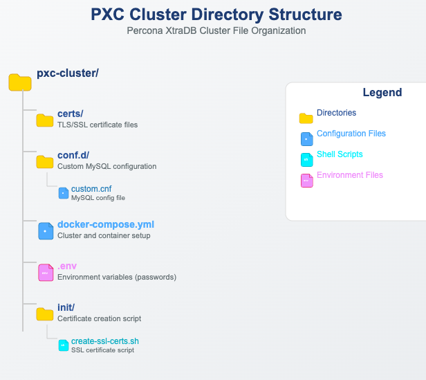

# Run with Docker Compose

For more information about using Docker, see the [Docker Docs](https://docs.docker.com/). Make
sure that you are using the latest version of Docker. The ones
provided via `apt` and `yum` may be outdated and cause errors.

We gather [Telemetry data](telemetry.md) in the Percona packages and Docker images.

--8<--- "get-help-snip.md"

This guide shows you how to deploy a three-node Percona XtraDB Cluster 8.4 using Docker Compose. You generate SSL certificates on the first node and copy them to the other two nodes to enable secure communication.

The following procedure describes setting up a simple 3-node cluster
for evaluation and testing purposes. Do not use these instructions in a
production environment because the MySQL certificates generated in this
procedure are self-signed.

In a production environment, you should generate and store the certificates to be used by Docker and configure proper storage, security, backup, and monitoring systems.

## Prerequisites

* Docker and Docker Compose installed

* At least 3 GB of memory per container
	
* Familiarity with Docker volumes and networks

## Directory Structure

You must create a separate directory structure to organize your configuration, certificate files, and Docker Compose setup. This step keeps your deployment clean and easy to manage.

Run the following commands to create the directory structure:

```{.bash data-prompt="$"}
$ mkdir -p pxc-cluster/{certs,conf.d,init}
$ cd pxc-cluster
```

After running these commands, your working directory (pxc-cluster/) will contain:



This structure helps manage configuration files, TLS/SSL certificates, and setup scripts, ensuring a tidy and easy-to-manage deployment.
{.power-number}

1. Create conf.d/custom.cnf with minimal SSL settings:
  
    ```ini
    [mysqld]
    ssl-ca=/etc/mysql/certs/ca.pem
    ssl-cert=/etc/mysql/certs/server-cert.pem
    ssl-key=/etc/mysql/certs/server-key.pem
    ```

2. Create a file named `.env` in the directory root:

    ```ini
    MYSQL_ROOT_PASSWORD=rootpass
    XTRABACKUP_PASSWORD=xbpass
    ```
    
    Add `.env` to your .gitignore file to prevent committing secrets to version control.

3. Copy the SSL certificate generation script. Save the script as `init/create-ssl-certs.sh`:

    ```ini
    #!/bin/bash
    set -e
    
    CERT_DIR=./certs
    mkdir -p "$CERT_DIR"
    cd "$CERT_DIR"
    
    # Generate CA key and certificate
    openssl genrsa -out ca-key.pem 2048
    openssl req -new -x509 -nodes -days 3650 \
        -key ca-key.pem \
        -subj "/C=XX/ST=State/L=City/O=Organization/CN=RootCA" \
        -out ca.pem
    
    # Generate server key and CSR
    openssl req -newkey rsa:2048 -nodes \
        -keyout server-key.pem \
        -subj "/C=XX/ST=State/L=City/O=Organization/CN=pxc-node" \
        -out server-req.pem
    
    # Sign server certificate with CA
    openssl x509 -req -in server-req.pem -days 3650 \
        -CA ca.pem -CAkey ca-key.pem -set_serial 01 \
        -out server-cert.pem
    
    # Restrict permissions
    chmod 600 *.pem
  
    ```

4. Make the script executable:

    ```{.bash data-prompt="$"}
    $ chmod +x init/create-ssl-certs.sh
    ```
  
5. Run the script to create the certs:

    ```{.bash data-prompt="$"}
    $ ./init/create-ssl-certs.sh
    ```

4. Copy Certificates to All Nodes

    All three nodes in the cluster must use the same set of SSL certificates. After generating the certificates in the certs/ directory on node 1, you need to copy them to the directories for node 2 and node 3.
    
    If you run all containers from a single project directory (like with Docker Compose on one host), you can reuse the same certs/ directory for all nodes. However, you must explicitly copy the certificates if you’re organizing them into separate directories or deploying on separate hosts.
  
    To create the directories for node 2 and node 3:
    
    ```{.bash data-prompt="$"}
    $ mkdir -p certs-node2
    $ mkdir -p certs-node3
    ```
    
    Then copy the certificates:
    
    ```{.bash data-prompt="$"}
    $ cp -r certs/* certs-node2/
    $ cp -r certs/* certs-node3/
    ```
    
    If you’re deploying on separate machines, run the following from node 1:
    
    ```{.bash data-prompt="$"}
    $ scp -r ./certs/ user@node2-host:/path/to/pxc-cluster/certs
    $ scp -r ./certs/ user@node3-host:/path/to/pxc-cluster/certs
    ```
    
    Ensure each container mounts its own copy of the certs/ directory.

5. Create docker-compose.yml:

    ```yaml
  
    services:
      pxc1:
        image: percona/percona-xtradb-cluster:8.4
        container_name: pxc1
        environment:
          - MYSQL_ROOT_PASSWORD=${MYSQL_ROOT_PASSWORD}
          - CLUSTER_NAME=pxc-cluster
          - CLUSTER_JOIN=pxc2,pxc3
          - XTRABACKUP_PASSWORD=${XTRABACKUP_PASSWORD}
        volumes:
          - ./certs:/etc/mysql/certs:ro
          - ./conf.d:/etc/percona-xtradb-cluster.conf.d:ro
        networks:
          - pxcnet
        ports:
          - "3306:3306"
        command: ["--wsrep-new-cluster"]
        healthcheck:
          test: ["CMD", "mysqladmin", "ping", "-h", "localhost"]
          interval: 10s
          timeout: 5s
          retries: 5
    
      pxc2:
        image: percona/percona-xtradb-cluster:8.4
        container_name: pxc2
        environment:
          - MYSQL_ROOT_PASSWORD=${MYSQL_ROOT_PASSWORD}
          - CLUSTER_NAME=pxc-cluster
          - CLUSTER_JOIN=pxc1,pxc3
          - XTRABACKUP_PASSWORD=${XTRABACKUP_PASSWORD}
        volumes:
          - ./certs:/etc/mysql/certs:ro
          - ./conf.d:/etc/percona-xtradb-cluster.conf.d:ro
        networks:
          - pxcnet
        healthcheck:
          test: ["CMD", "mysqladmin", "ping", "-h", "localhost"]
          interval: 10s
          timeout: 5s
          retries: 5
    
      pxc3:
        image: percona/percona-xtradb-cluster:8.4
        container_name: pxc3
        environment:
          - MYSQL_ROOT_PASSWORD=${MYSQL_ROOT_PASSWORD}
          - CLUSTER_NAME=pxc-cluster
          - CLUSTER_JOIN=pxc1,pxc2
          - XTRABACKUP_PASSWORD=${XTRABACKUP_PASSWORD}
        volumes:
          - ./certs:/etc/mysql/certs:ro
          - ./conf.d:/etc/percona-xtradb-cluster.conf.d:ro
        networks:
          - pxcnet
        healthcheck:
          test: ["CMD", "mysqladmin", "ping", "-h", "localhost"]
          interval: 10s
          timeout: 5s
          retries: 5
    
    networks:
      pxcnet:
        driver: bridge
    ```

6. Start the Cluster

    Start node 1 to initialize the cluster:
    
    ```{.bash data-prompt="$"}
    $ docker compose up -d pxc1
    ```

    Then, start the remaining nodes:
    
    ```{.bash data-prompt="$"}
    $ docker compose up -d pxc2 pxc3
    ```

7. Validate the Cluster

    Check the status of each node:
    
    ```{.bash data-prompt="$"}
    docker exec -it pxc1 mysql -uroot -p${MYSQL_ROOT_PASSWORD} -e "SHOW STATUS LIKE 'wsrep_cluster_size';"
    docker exec -it pxc2 mysql -uroot -p${MYSQL_ROOT_PASSWORD} -e "SHOW STATUS LIKE 'wsrep_cluster_status';"
    ```

You should see all three nodes joined and synchronized.

