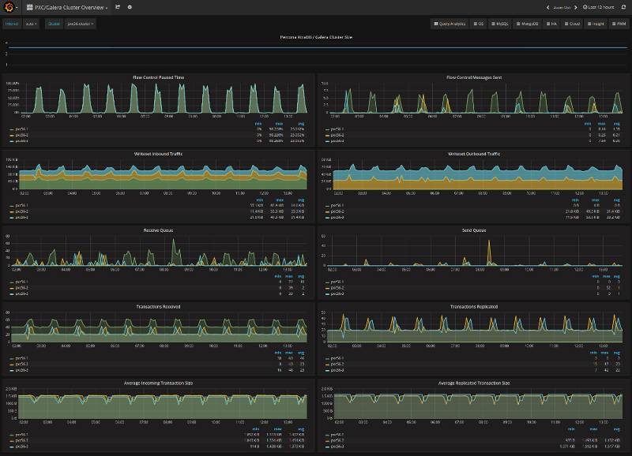
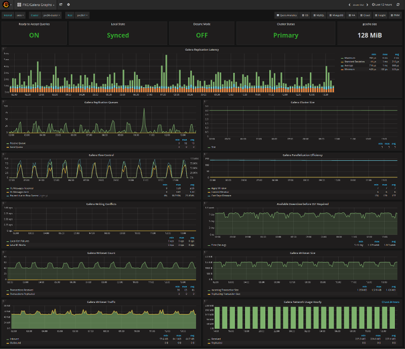
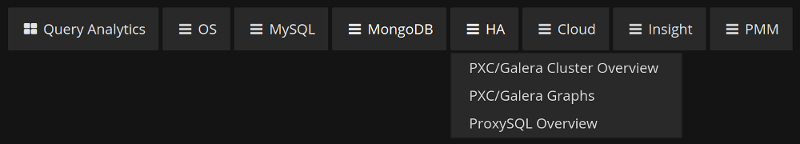

# Monitor the cluster

Each node can have a different view of the cluster.
There is no centralized node to monitor.
To track down the source of issues,
you have to monitor each node independently.

Values of many variables depend on the node from which you are querying.
For example, replication sent from a node
and writes received by all other nodes.

Having data from all nodes can help you understand
where flow messages are coming from,
which node sends excessively large transactions,
and so on.

## Manual monitoring

Manual cluster monitoring can be performed using
[myq-tools :octicons-link-external-16:](https://github.com/jayjanssen/myq-tools/).

## Alerting

Besides standard MySQL alerting,
you should use at least the following triggers specific to Percona XtraDB Cluster:

* Cluster state of each node

  [`wsrep_cluster_status`](wsrep-status-index.md#wsrep_cluster_status) != Primary

* Node state

  [`wsrep_connected`](wsrep-status-index.md#wsrep_connected) != `ON`

  [`wsrep_ready`](wsrep-status-index.md#wsrep_ready) != `ON`

For additional alerting, consider the following:

* Excessive replication conflicts can be identtified using the [`wsrep_local_cert_failures`](wsrep-status-index.md#wsrep_local_cert_failures) and [`wsrep_local_bf_aborts`](wsrep-status-index.md#wsrep_local_bf_aborts) variables

* Excessive flow control messages can be identified using the [`wsrep_flow_control_sent`](wsrep-status-index.md#wsrep_flow_control_sent) and [`wsrep_flow_control_recv`](wsrep-status-index.md#wsrep_flow_control_recv) variables

* Large replication queues can be identified using the [`wsrep_local_recv_queue`](wsrep-status-index.md#wsrep_local_recv_queue).

## Metrics

Cluster metrics collection for long-term graphing should be done
at least for the following:

* Queue sizes:

  [`wsrep_local_recv_queue`](wsrep-status-index.md#wsrep_local_recv_queue) and [`wsrep_local_send_queue`](wsrep-status-index.md#wsrep_local_send_queue)

* Flow control:

  [`wsrep_flow_control_sent`](wsrep-status-index.md#wsrep_flow_control_sent) and [`wsrep_flow_control_recv`](wsrep-status-index.md#wsrep_flow_control_recv)

* Number of transactions for a node:

  [`wsrep_replicated`](wsrep-status-index.md#wsrep_replicated) and [`wsrep_received`](wsrep-status-index.md#wsrep_received)

* Number of transactions in bytes:

  [`wsrep_replicated_bytes`](wsrep-status-index.md#wsrep_replicated_bytes) and [`wsrep_received_bytes`](wsrep-status-index.md#wsrep_received_bytes)

* Replication conflicts:

  [`wsrep_local_cert_failures`](wsrep-status-index.md#wsrep_local_cert_failures) and [`wsrep_local_bf_aborts`](wsrep-status-index.md#wsrep_local_bf_aborts)

## Use Percona Monitoring and Management

[Percona Monitoring and Management :octicons-link-external-16:](https://docs.percona.com/percona-monitoring-and-management/3/) includes two dashboards to monitor PXC:

1. PXC/Galera Cluster Overview:

    

2. PXC/Galera Graphs:

    

    These dashboards are available from the menu:

    

Please refer to the [official documentation :octicons-link-external-16:](https://docs.percona.com/percona-monitoring-and-management/3/) for details on Percona Monitoring and Management installation and setup.

!!! note "Query Analytics data sources and prepared statements"

    PMM Query Analytics (QAN) collects MySQL queries from either the slow query log
    written to a file (`log_output=FILE`) or from Performance Schema. It cannot read
    the general query log or a slow query log written to a table (`log_output=TABLE`).

    If your application uses server-side prepared statements (common with drivers
    such as JDBC), expect partial data on the Performance Schema source: query
    examples appear as placeholders (`?`) instead of literal values, and EXPLAIN is
    unavailable for them. This is how upstream MySQL exposes prepared statements to
    Performance Schema, not a PMM limitation. The file-based slow query log records
    executed statements with their real values, so examples and EXPLAIN are fuller
    there. See the
    [PMM Query Analytics documentation :octicons-link-external-16:](https://docs.percona.com/percona-monitoring-and-management/3/use/qan/index.html)
    for details.

## Other reading

* [Realtime stats to pay attention to in PXC and Galera :octicons-link-external-16:](https://www.mysqlperformanceblog.com/2012/11/26/realtime-stats-to-pay-attention-to-in-percona-xtradb-cluster-and-galera/)

