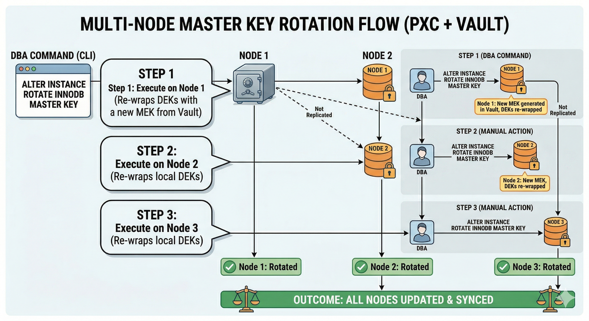
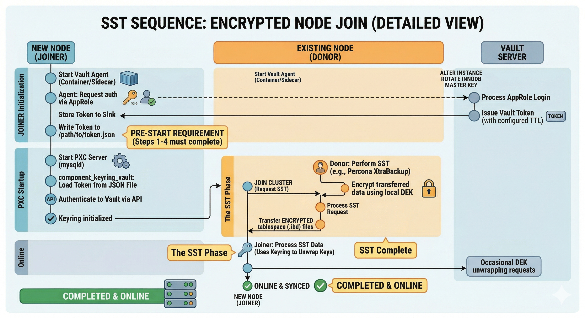
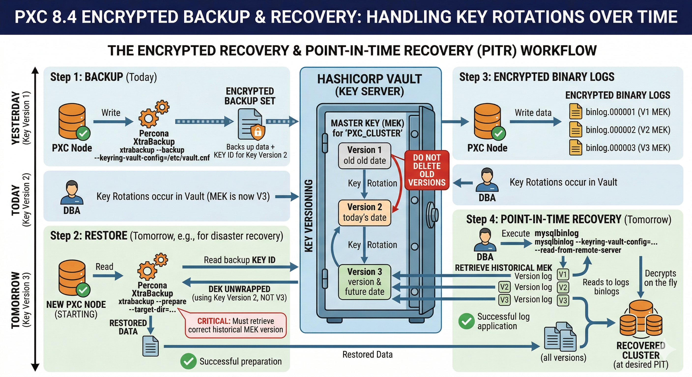

# Operate encrypted PXC clusters

Use this page for ongoing tasks on encrypted Percona XtraDB Cluster (PXC): rotation, SST, backups, Vault token management, disaster recovery, and verification.

New to encryption? See [Encrypt data for the first time](quickstart-encrypt-data.md). For concepts, keyring configuration, and failure mode reference, see [Data at rest encryption](data-at-rest-encryption.md).

## Introduction

* [Rotate the InnoDB master key](#rotate-the-innodb-master-key) — rolling rotation, replication, and async replica behavior.

* [SST configuration](#sst-configuration-and-the-sst-section) — `[sst]` options for encrypted State Snapshot Transfer.

* [Backups and restore](#backups-and-restore-for-encrypted-clusters) — XtraBackup privileges, backup, prepare, restore.

* [Vault keyring operations](#vault-keyring-operations) — token reload, AppRole, startup order, disaster recovery.

* [Day 2 runbooks](#day-2-operations-for-highly-available-clusters) — cadence, incidents, monitoring.

* [Verification checklists](#verification-checklists) — post-rotation, Vault drill, restore.

* [Key migration](#migrate-keys-between-keyring-keystores) — offline and online keystore migration.

## Rotate the InnoDB master key

`ALTER INSTANCE ROTATE INNODB MASTER KEY` replaces the InnoDB master encryption key. The statement re-encrypts existing tablespace keys inside the keyring on the server where the statement runs. Encrypted pages on disk are not rewritten immediately. Data pages re-encrypt with the new master key when they load into memory and write back to disk. This follows the standard InnoDB process. See [Concepts](data-at-rest-encryption.md#concepts) for the relationship between the master key and tablespace keys.

Run rotation on a live member:

```sql
ALTER INSTANCE ROTATE INNODB MASTER KEY;
```

??? example "Expected outcome (client)"

    ```{.text .no-copy}
    Query OK, 0 rows affected (0.03 sec)
    ```

Check the error log around the time of rotation for keyring or InnoDB messages. When rotation fails, do not assume later DML on encrypted objects is safe. Investigate and correct the failure first.

### Replication and cluster behavior

Galera replication does not replicate `ALTER INSTANCE ROTATE INNODB MASTER KEY` automatically. Run the statement on each member to update that member's keyring state.

With binary logging, `ALTER INSTANCE ROTATE INNODB MASTER KEY` is recorded. PXC peers do not synchronize the key automatically. Plan to rotate on each cluster member as needed.

### Example: asynchronous replica that reads the PXC binary log

An asynchronous replica uses `CHANGE REPLICATION SOURCE TO` (or legacy `CHANGE MASTER TO`) against one PXC writer. Binary logging is enabled on the writer. The replica applies events from the writer binary log.

1. On the PXC writer, run `ALTER INSTANCE ROTATE INNODB MASTER KEY;`. The statement succeeds. The server records the Data Definition Language (DDL) in the binary log when binary logging is on.

2. The replica applies the same statement from the relay log. That execution rotates the InnoDB master key on the replica. The replica uses its own keyring (`component_keyring_file` path or `component_keyring_vault` token and `secret_mount_point` on the replica host).

3. The replica must already load the keyring component. The account that applies the event needs the `ENCRYPTION_KEY_ADMIN` privilege. With Vault, the replica must reach Vault with a valid token. A replica without a working keyring cannot complete the same rotation step the writer performed.

Operational pattern: finish the rolling rotation on every PXC member first. Then check that the asynchronous replica applied the binary log event without errors. Use `SHOW REPLICA STATUS\G` and the replica error log. When the replica lags intentionally or replication is filtered, plan a separate rotation on the replica after the cluster rotation completes. You can also accept that the replica master key age diverges until rotation runs on the replica. Never assume the replica keyring state matches a PXC node. Always verify directly.

```sql
SHOW REPLICA STATUS\G
```

??? example "Expected outcome (excerpt, healthy apply path)"

    ```{.text .no-copy}
    ...
                 Replica_IO_Running: Yes
                Replica_SQL_Running: Yes
                  Last_SQL_Errno: 0
                  Last_SQL_Error:
    ...
    ```

    When `Last_SQL_Errno` is non-zero or `Replica_SQL_Running` is `No`, read `Last_SQL_Error` and the replica error log before the next rotation on the writer.

### Propagation through the cluster

The cluster has no automatic cluster-wide rotation. To align key age or policy across the cluster, run `ALTER INSTANCE ROTATE INNODB MASTER KEY` on each cluster node in turn during a planned window. Suggested pattern:



1. Pick one member at a time. Avoid rotating all members during peak load when extra I/O is a concern.

2. On the chosen member, run `ALTER INSTANCE ROTATE INNODB MASTER KEY;` and confirm success in the log.

3. Repeat for every remaining member. A node that has not been rotated keeps the previous master key material for that node until you run the statement on that node.

4. After the last member completes rotation, verify encrypted workloads on each node. For example, run `SELECT` from encrypted tables or short maintenance queries.

Plan the order and timing so SST and normal replication traffic remain supported. Mixed states (some members rotated, some not) are normal for a short interval. Prolonged divergence without a clear reason warrants investigation.

With `component_keyring_file`, each node holds a keyring file local to that node. Rotation affects only the node where the command runs. With `component_keyring_vault`, several nodes may share the same Vault mount and secret paths depending on deployment. Coordinate rotation with Vault policies and monitoring so every instance resolves the same logical keys after the operation. Confirm connectivity to Vault before you rotate on each node.

GCache encryption uses a separate rotation statement (`ALTER INSTANCE ROTATE GCACHE MASTER KEY`). See [GCache and Write-Set cache encryption](gcache-write-set-cache-encryption.md).

For more background on InnoDB encryption and rotation semantics, see [Percona Server for MySQL: InnoDB data encryption :octicons-link-external-16:](https://docs.percona.com/percona-server/{{vers}}/data-at-rest-encryption.html).

### SST configuration and the `[sst]` section

State Snapshot Transfer (SST) runs Percona XtraBackup on the donor and on the joiner. The SST script builds a default `xtrabackup` command line. The default is enough for many installs. Extend the script when the keyring manifest or `component_keyring_*` paths live outside the usual layout. Extend the script when `xtrabackup` needs an explicit `--defaults-file`. Extend the script when component or plugin directories differ from what the script assumes and you must pass the missing flags yourself.



Add those flags under the `[sst]` group in `my.cnf`:

* `inno-backup-opts` (donor backup stage)

* `inno-apply-opts` (joiner prepare or apply stage)

* `inno-move-opts` (joiner move stage)

The SST script appends them to the corresponding `xtrabackup` invocation. Use the same paths and keyring-related options `mysqld` uses on that host. XtraBackup can then read the same keys during SST.

Timeouts, transfer method, compression, and SSL for the SST channel are also configured under `[sst]`. For a full list of parameters and examples, see [Percona XtraBackup SST configuration](xtrabackup-sst.md#percona-xtrabackup-sst-configuration).

!!! note

    When you use `component_keyring_vault`, SST must use a method that supports Vault. For example, use XtraBackup-based SST. The section [Configure PXC to use component_keyring_vault component](data-at-rest-encryption.md#configure-pxc-to-use-component_keyring_vault-component) notes that rsync SST is not supported with `component_keyring_vault`.

## Backups and restore for encrypted clusters

Encrypted tablespaces remain opaque without the matching keyring material. Backup design must cover both the data copy and the keystore that backs the keys.

Use Percona XtraBackup {{vers}} with PXC {{vers}} (see [XtraBackup SST dependencies](xtrabackup-sst.md#xtrabackup-sst-dependencies)). The flow reflects a typical production backup path. Adjust paths, users, and retention for your site.



### Percona XtraBackup: privileges for encrypted instances

Create a dedicated backup account on each node you back up. The following grants match the minimum set described in [Percona XtraBackup connection and privileges :octicons-link-external-16:](https://docs.percona.com/percona-xtrabackup/{{vers}}/privileges.html) for full backups (including `SELECT` on `performance_schema.keyring_component_status`):

```sql
CREATE USER 'bkpuser'@'localhost' IDENTIFIED BY 's3cr%T';
GRANT BACKUP_ADMIN, PROCESS, RELOAD, LOCK TABLES, REPLICATION CLIENT ON *.* TO 'bkpuser'@'localhost';
GRANT SELECT ON performance_schema.log_status TO 'bkpuser'@'localhost';
GRANT SELECT ON performance_schema.keyring_component_status TO 'bkpuser'@'localhost';
GRANT SELECT ON performance_schema.replication_group_members TO 'bkpuser'@'localhost';
FLUSH PRIVILEGES;
```

??? example "Expected outcome (client)"

    ```{.text .no-copy}
    Query OK, 0 rows affected (0.01 sec)
    ...
    Query OK, 0 rows affected (0.00 sec)
    ```

Replication topologies may also need `REPLICATION_SLAVE_ADMIN` on the account that runs XtraBackup (same upstream privileges page). Confirm with:

```sql
SHOW GRANTS FOR 'bkpuser'@'localhost';
```

??? example "Expected outcome (sample SHOW GRANTS output)"

    ```{.text .no-copy}
    +-------------------------------------------------------------+
    | Grants for bkpuser@localhost                                |
    +-------------------------------------------------------------+
    | GRANT BACKUP_ADMIN, PROCESS, RELOAD, LOCK TABLES, ... ON *.* |
    | GRANT SELECT ON `performance_schema`.`log_status` TO ...    |
    | GRANT SELECT ON `performance_schema`.`keyring_component_... |
    ...
    ```

### Percona XtraBackup: backup, prepare, restore

Run XtraBackup with `--defaults-file` set to the same option file `mysqld` uses on that host. For example, use `/etc/mysql/mysql.cnf`. That file tells XtraBackup where to find the keyring manifest and `component_keyring_*` paths. The backup process uses the same settings the server uses to decrypt data. Without those settings, the backup cannot read encrypted tablespaces. The following example stores a full backup in a dated directory:

```shell
xtrabackup --defaults-file=/etc/mysql/mysql.cnf --backup \
  --target-dir=/backup/$(date +%F)/full \
  --user=bkpuser --password='...'
```

??? example "Expected outcome (excerpt)"

    ```{.text .no-copy}
    ...
    xtrabackup: Transaction log of LSN (...): (...), was copied.
    xtrabackup: completed OK!
    ```

Prepare the backup offline on the backup host or a staging host with enough space:

```shell
xtrabackup --prepare --target-dir=/backup/$(date +%F)/full
```

??? example "Expected outcome (excerpt)"

    ```{.text .no-copy}
    ...
    xtrabackup: Shutdown completed; log sequence number ...
    xtrabackup: completed OK!
    ```

Restore on a clean data directory. Stop `mysqld` on the target. Remove or empty the old datadir except what your runbook allows. Fix ownership after copy:

```shell
xtrabackup --copy-back --target-dir=/backup/$(date +%F)/full
```

??? example "Expected outcome (excerpt)"

    ```{.text .no-copy}
    ...
    xtrabackup: completed OK!
    ```

Use `--move-back` instead of `--copy-back` when the runbook requires move rather than copy for prepared files. Start `mysqld` only after file ownership matches the database user.

Incremental and partial backups add flags such as `--incremental` and `--incremental-basedir`. See the [Percona XtraBackup {{vers}} manual :octicons-link-external-16:](https://docs.percona.com/percona-xtrabackup/{{vers}}/) when you need those workflows. The encrypted keyring requirement stays the same. The backup process must reach the same keys the server used.

### Keyring-specific notes for backups

#### `component_keyring_file`

Include the file named by `component_keyring_file_data` in backup scope. Use the same snapshot window as the XtraBackup run, or a copy taken under your storage team consistency rules. After `--copy-back`, place the keyring file at the path set in `component_keyring_file_data` in the restored `my.cnf` before you start `mysqld`. When you keep only `.ibd` files and lose the keyring file, you cannot decrypt user data.

#### `component_keyring_vault`

The `xtrabackup` process uses the server keyring configuration. `component_keyring_vault.cnf` must be valid on the host where backup runs. That host must reach `vault_url` with a token that can read the same secrets as `mysqld`. Firewall and certificate requirements apply to the backup host and the database node.

XtraBackup does not run Vault AppRole login or token renewal. The binary loads the same kind of component configuration `mysqld` uses. Paths come from `--defaults-file` and the manifest layout described in [Percona Server keyring vault component documentation :octicons-link-external-16:](https://docs.percona.com/percona-server/{{vers}}/use-keyring-vault-component.html). Whatever `token` value is in the JSON at backup time is what XtraBackup sends to Vault.

* Same token as the server: a common pattern on the database host reuses the same `component_keyring_vault.cnf` that Vault Agent (or a template) keeps updated. Run `xtrabackup` from cron or automation with `--defaults-file` that points at that instance. The operating system (OS) user that runs XtraBackup must read the JSON, `vault_ca` if set, and any separate file the JSON references. For example, copy from an agent sink before backup. Align ownership and mode with your security model. The backup user does not have to be the `mysql` system user. The keyring files must be readable for that user.

* Separate Vault token or AppRole: XtraBackup does not require a separate token for correctness. Many teams create a dedicated Vault policy and token (or AppRole consumed by a second agent or job) with read-only access to the same `secret_mount_point` paths. Deploy a second `component_keyring_vault.cnf` (or a backup-only defaults fragment) used only by the backup task. That limits blast radius when a backup host or cron credential leaks. XtraBackup only needs a token that can read the keys for that instance mount. Whether that token is shared with `mysqld` is an operational choice.

Remote or jump-host backups must ship the same configuration shape to the host that runs `xtrabackup`. Supply a valid token on that host (agent, secret store, or short-lived credential). Ensure that host can reach `vault_url`.

A successful restore still requires a live Vault (or restored Vault storage) at the expected mount. The restored server also needs a valid token. See [Disaster recovery](#disaster-recovery) and [Authentication lifecycle](data-at-rest-encryption.md#authentication-lifecycle).

### Binary logs and other encrypted streams

When binary log encryption or redo encryption is enabled, backup and disaster recovery (DR) plans must include whatever key material those features require. Follow [Percona Server for MySQL: InnoDB data encryption :octicons-link-external-16:](https://docs.percona.com/percona-server/{{vers}}/data-at-rest-encryption.html).


## Vault keyring operations

### Apply an updated token on a running server

`component_keyring_vault` does not poll the JSON configuration file. A change to `component_keyring_vault.cnf` on disk does not replace the token the running server already holds in memory from the last startup or reload.

After automation writes a new token, use one of the following:

* Reload the keyring component without a full `mysqld` restart. On Percona Server for MySQL {{vers}}, run `ALTER INSTANCE RELOAD KEYRING`. The server instructs the installed keyring component to re-read its configuration file and reinitialize in-memory keyring data. A revised `token` value in the file takes effect after this statement succeeds. The account needs the `ENCRYPTION_KEY_ADMIN` privilege. The statement is not written to the binary log. Execute the statement on each PXC member when that member JSON file changes. You can also invoke the statement from per-host automation. See [ALTER INSTANCE Statement :octicons-link-external-16:](https://dev.mysql.com/doc/refman/{{vers}}/en/alter-instance.html) in the MySQL Reference Manual.

```sql
ALTER INSTANCE RELOAD KEYRING;
```

??? example "Expected outcome (client)"

    ```{.text .no-copy}
    Query OK, 0 rows affected (0.01 sec)
    ```

* Restart `mysqld`. A stop and start cycle reloads component configuration from disk. Prefer this path when your runbook already uses restarts, or when you troubleshoot a failed reload.

Write the updated JSON with an atomic replace when possible. For example, write to a temporary file in the same directory, then rename into `component_keyring_vault.cnf`. The server never reads a partially written file when automation and `ALTER INSTANCE RELOAD KEYRING` overlap.

### Example: AppRole with Vault Agent (illustrative)

The following outlines a common pattern. Adjust paths, mount names, and TTLs for production. Full AppRole hardening belongs in [HashiCorp AppRole documentation :octicons-link-external-16:](https://developer.hashicorp.com/vault/docs/auth/approle).

1. On the Vault server, enable the AppRole auth method and create a policy that allows the keyring paths your `secret_mount_point` uses (KV read and write as required by [Percona Server keyring vault component documentation :octicons-link-external-16:](https://docs.percona.com/percona-server/{{vers}}/use-keyring-vault-component.html)).

2. Create an AppRole bound to that policy. Distribute `role_id` and `secret_id` to the database host with your secret distribution standard. Never commit real values to configuration repositories. When Secret IDs expire or rotate, use the same standards. See [AppRole Secret ID lifecycle](#approle-secret-id-lifecycle).

3. Run Vault Agent on the PXC host with `auto_auth` similar to:

```{.text .no-copy}
pid_file = "/var/run/vault-agent-pid"

vault {
  address = "https://vault.example.com:8200"
  ca_cert = "/etc/mysql/vault-ca.pem"
}

auto_auth {
  method "approle" {
    config = {
      role_id_file_path   = "/etc/mysql/vault/role_id"
      secret_id_file_path = "/etc/mysql/vault/secret_id"
    }
  }
  sink "file" {
    config = {
      path = "/var/lib/mysql-vault/token"
      mode = 0640
    }
  }
}
```

4. Point `component_keyring_vault.cnf` at the token the agent maintains. When the component on your build only accepts an inline `token` value, use an agent `template` block to render the full JSON file whenever the token rotates. You can also run a short wrapper script that copies the sink file into the `token` field and then runs `ALTER INSTANCE RELOAD KEYRING` (with `ENCRYPTION_KEY_ADMIN`) or signals a controlled `mysqld` restart. Confirm the exact integration path against the Percona Server version in use.

Equivalent one-off login from a shell session (useful for testing, not a substitute for renewal automation):

```shell
vault write -field=token auth/approle/login role_id="$ROLE_ID" secret_id="$SECRET_ID"
```

??? example "Expected outcome"

    ```{.text .no-copy}
    hvs.CAESIJ3NmnVQN...
    ```

A single-line token is printed to standard output (no table). Paste the returned value into the `token` field only for short-lived tests. Production still requires Vault Agent or cron-driven renewal before TTL expiry.

### AppRole Secret ID lifecycle

Vault Agent AppRole `auto_auth` exchanges the `role_id` and `secret_id` read from disk for a Vault token. The agent maintains that token (renewal or re-authentication per agent settings). That path covers token TTL, not the lifecycle of the Secret ID file on disk. Whether a Secret ID expires or must rotate deliberately is controlled on the Vault side (`secret_id_ttl`, `bind_secret_id`, and related AppRole settings). See [HashiCorp AppRole documentation :octicons-link-external-16:](https://developer.hashicorp.com/vault/docs/auth/approle).

`mysqld` and `component_keyring_vault` never handle Secret IDs. When a Secret ID must reach the PXC host, rely on the same secret-distribution layer you use for other machine credentials. For example:

* Issue a Secret ID from Vault with a tightly scoped operator or automation role. Optionally use [response wrapping :octicons-link-external-16:](https://developer.hashicorp.com/vault/docs/concepts/response-wrapping) or another one-time delivery pattern. Write the value to `secret_id_file_path` with strict ownership and mode.

* Pull from your organization secrets store (cloud SM, Kubernetes `Secret`, configuration management with audit) into that path during provision or rotation windows.

* After the file changes, restart Vault Agent (or use the reload procedure HashiCorp documents for your agent version). Confirm the token sink still updates. When applicable, confirm `ALTER INSTANCE RELOAD KEYRING` or your restart policy still applies for `mysqld`.

Percona XtraDB Cluster documentation does not prescribe a single vendor workflow for Secret ID rotation. Align with Vault operations and compliance requirements at your site.

### Startup order: Vault Agent before `mysqld`

A PXC joiner (and any node where `mysqld` starts cold) needs a working Vault token as soon as the server opens encrypted tablespaces. The joiner also needs a working token when SST or XtraBackup stages need the keyring. The following avoids a common race. `mysqld` starts while Vault Agent has not finished its first `auto_auth` and the sink or template has not written a usable token. These guidelines do not replace your own systemd units, Helm charts, or compose files. Encode the order and timeouts there.

* With systemd, run Vault Agent in its own service. Make the `mysqld` unit start after that service (`After=vault-agent.service`). Keep the dependency explicit (`Requires=vault-agent.service` or `Wants=vault-agent.service`, per your policy). A `Type=simple` agent is often considered started as soon as the process exists. That can happen before the first token write completes. Add a guarded wait on the `mysqld` side. For example, use an `ExecStartPre` script or drop-in that loops until the token file (or rendered `component_keyring_vault.cnf`) exists and is non-empty. Set a timeout and a clear log line when the wait fails.

* With containers, use an init container or entrypoint step that blocks until the same condition is true before `exec` `mysqld`. You can also run the agent as a sidecar and start `mysqld` only after a health check or wait script sees a valid token path. Orchestrator `depends_on` alone usually reflects container start order, not first auth success. Pair `depends_on` with an explicit wait or readiness probe wired to the token file.

* A joiner that undergoes SST follows the same rule. When the node service comes up for a join, the token path the keyring reads must already be populated. XtraBackup-based or Clone SST can then use `component_keyring_vault` on that host.

For `auto_auth`, sinks, and templates, see HashiCorp [Vault Agent :octicons-link-external-16:](https://developer.hashicorp.com/vault/docs/agent-and-proxy/agent) documentation.

### Recommended approach summary

Prefer Vault Agent on each PXC host so Vault issues and renews tokens on the local machine. Integrate agent output with `component_keyring_vault.cnf` so the token value stays valid before the credential TTL expires. Follow your change policy and the [Percona Server keyring vault component documentation :octicons-link-external-16:](https://docs.percona.com/percona-server/{{vers}}/use-keyring-vault-component.html).

Without renewal, expect a cluster-wide outage risk. Every node that uses an expired token loses access to encryption keys when those nodes restart or when the keyring next contacts Vault.
### Disaster recovery

!!! warning

    Vault as a control plane for data access: with `component_keyring_vault`, the Vault service and the network path to Vault become a single point of failure for access to encrypted data. When Vault is unavailable, nodes may refuse to start or cannot decrypt tablespaces even though data files on disk are intact. High availability, monitoring, and disaster recovery planning for Vault are as important as planning for the database tier.

Backups and keyring metadata: day-to-day backup scope for encrypted PXC is described in [Backups and restore for encrypted clusters](#backups-and-restore-for-encrypted-clusters). A physical backup of the datadir alone is not sufficient to recover encrypted data when Vault secrets are lost or when the keyring cannot reach Vault. Your backup and DR procedures must include:

* Vault data and policy: back up Vault own storage (or rely on Vault supported replication and snapshot model) so secrets engine data and mounts can restore. Document mount paths, KV version, and ACL policies used by `component_keyring_vault`.

* Keyring configuration: securely retain copies of `component_keyring_vault.cnf` (without long-lived plaintext tokens where avoidable), Certificate Authority (CA) material (`vault_ca`), and any automation (for example, Vault Agent or AppRole role IDs) needed to obtain a valid token after restore.

* Percona Server or PXC configuration: include manifest and `my.cnf` fragments that load `component_keyring_vault` so a restored host can load the same component configuration.

Restore drills should verify that a recovered node can authenticate to Vault and that encrypted tables open successfully before you rely on the procedure in production.
## Day 2 operations for highly available clusters

Highly available PXC depends on more than a healthy quorum. Backups must be restorable while keys remain available. Rotations must not surprise async replicas. Incidents that involve Vault or tokens need a written path. Use the following subsections as runbook starters. Fold them into your change-management templates.

### Operational cadence (what to put on the calendar)

| Cadence | Suggested focus |
| --- | --- |
| Daily or weekly | Automated backup success per policy (every node that takes a local backup, or the shared tooling you use). Alert on non-zero exit codes from `xtrabackup` jobs. |
| Monthly | Spot-check that backup artifacts and key material (keyring file or Vault path plus token renewal) still line up with the restore runbook. |
| Quarterly | Execute a restore test on non-production hardware or a disposable instance. Include `component_keyring_vault` token acquisition the same way production does. |
| Per security policy | Rolling `ALTER INSTANCE ROTATE INNODB MASTER KEY` on each member. When GCache encryption is enabled, plan `ALTER INSTANCE ROTATE GCACHE MASTER KEY` per [GCache encryption](gcache-write-set-cache-encryption.md). |
| Before Vault or OS upgrades | Reconfirm TTL against Vault Agent or cron renewal. Schedule a maintenance window when `mysqld` restarts are required after config changes. |

Write down Recovery Point Objective (RPO) and Recovery Time Objective (RTO) targets for two cases:

* Loss of a single PXC member (usually SST or restore from backup)

* Loss of Vault storage (cluster data may exist on disk but stay unreadable until Vault returns)

### HA-aware rotation sequencing

1. Confirm cluster health (`wsrep_cluster_status`, `wsrep_cluster_size`, flow control off) before the first rotation:

```sql
SHOW STATUS LIKE 'wsrep_cluster_status';
SHOW STATUS LIKE 'wsrep_cluster_size';
```

??? example "Expected outcome (healthy cluster, illustrative)"

    ```{.text .no-copy}
    +----------------------+---------+
    | Variable_name        | Value   |
    +----------------------+---------+
    | wsrep_cluster_status | Primary |
    +----------------------+---------+
    +----------------------+-------+
    | Variable_name        | Value |
    +----------------------+-------+
    | wsrep_cluster_size   | 3     |
    +----------------------+-------+
    ```

    Exact `Value` strings depend on Galera version and topology. Treat anything other than a primary cluster with the expected member count as a blocker until the state is understood.

2. Rotate one member at a time. Prefer members that are not the sole source of read traffic your app relies on. Avoid heavy rotation I/O on the same host that is already donor for an SST.

3. After each member, run the checks under [After rolling `ALTER INSTANCE ROTATE INNODB MASTER KEY`](#after-rolling-alter-instance-rotate-innodb-master-key) in the verification checklists before you touch the next host.

4. When rotation errors occur on a member, stop the rollout. Capture the error log. Restore Vault or file keyring access on that host. Continue only when encrypted reads succeed there again.

5. When asynchronous replicas consume the writer binary log, plan their rotation or relay log apply order as described under [Example: asynchronous replica that reads the PXC binary log](#example-asynchronous-replica-that-reads-the-pxc-binary-log).

The product has no supported undo of a completed InnoDB master key rotation. Forward-fix keyring and Vault issues instead of revert the statement.

### Backups and restore when the cluster is under stress

* A failed `xtrabackup` job on one node does not by itself break Galera. You lose redundancy in your backup history. Treat repeat failures as a production risk.

* Stagger heavy full backups across members when disk and network headroom are tight. Each backup still needs the same keyring or Vault access as `mysqld`.

* Restoring a single evicted member: follow your standard PXC procedure (often wipe the local datadir and rejoin for SST, or restore a prepared backup into an empty datadir) only after `component_keyring_vault.cnf` and Vault connectivity match production on that host.

* Total cluster loss: bring Vault (or restored Vault storage) and valid tokens online first. Then follow the backup, prepare, and restore commands under [Backups and restore for encrypted clusters](#backups-and-restore-for-encrypted-clusters). Start members according to your bootstrap runbook.

### Incident playbooks: Vault, tokens, and SST

#### Vault endpoint unreachable while `mysqld` is still running

Avoid restart every node at once. Running instances may continue to serve cached paths until an operation needs a Vault round-trip. Open a Sev-1 on the Vault or network path. Validate TCP or TLS from one database host (`curl` to `vault_url` with CA). Restore HA Vault service. After recovery, use a single canary `mysqld` restart in staging before mass restarts in production.

#### `permission denied` or token expiry after a restart

Renew the token through Vault Agent or your cron workflow. Update `component_keyring_vault.cnf` when your process writes the token there. Run `ALTER INSTANCE RELOAD KEYRING` on that member (with `ENCRYPTION_KEY_ADMIN`) or restart `mysqld`. Confirm encrypted tables. Roll the same steps across the rest of the cluster.

#### Joiner aborts SST with `component_keyring_vault`

Confirm the joiner uses XtraBackup-based or Clone SST (not rsync). Verify the joiner reaches `vault_url`, uses the correct `secret_mount_point`, and carries a valid token before `mysqld` and SST stages need the keyring (see [Startup order: Vault Agent before `mysqld`](#startup-order-vault-agent-before-mysqld)). Inspect donor and joiner SST logs. See [Percona XtraBackup SST configuration](xtrabackup-sst.md#percona-xtrabackup-sst-configuration).

#### Encrypted table errors only on one member

Compare `SHOW COMPONENTS` and keyring config paths with a healthy peer. For `component_keyring_file`, compare file permissions and inode. For Vault, compare effective policy and mount path. Do not `DELETE` Galera state files without following your cluster recovery documentation before any destructive step.

### Monitoring and alerts (minimum)

Point monitoring at:

* MySQL error log lines that contain `component_keyring_vault`, `keyring`, `Could not retrieve`, `permission denied`, or `Failed to connect` toward `vault_url`

* Backup scheduler exit status and backup size trends (sudden shrink may mean an empty or failed run)

* PXC variables such as `wsrep_cluster_status`, `wsrep_local_state_comment`, and flow control counters after maintenance

Correlate Vault HA health checks with database alarms so on-call knows whether to page the Vault team or the database administrator (DBA) team first.

## Verification checklists

Use these during maintenance windows or when you validate automation. Record hostnames, timestamps, and log excerpts in the change ticket.

### After rolling `ALTER INSTANCE ROTATE INNODB MASTER KEY`

On each cluster member where rotation ran:

1. Scan the error log from a few minutes before and after the rotation for `keyring`, `InnoDB`, or `ER_` messages. Treat errors as blocking until reviewed.

2. Run a read query against at least one known encrypted table. Compare a checksum or row count against another member when your policy requires symmetry:

```sql
SELECT COUNT(*) AS cnt FROM schema_name.encrypted_table LIMIT 1;
```

??? example "Expected outcome"

    ```{.text .no-copy}
    +-----+
    | cnt |
    +-----+
    |  42 |
    +-----+
    ```

3. Optional: inspect keyring status (exact columns vary by release):

```sql
SELECT * FROM performance_schema.keyring_component_status;
```

??? example "Expected outcome (excerpt)"

    ```{.text .no-copy}
    +---------------------+------------------------------------------+
    | STATUS_KEY          | STATUS_VALUE                             |
    +---------------------+------------------------------------------+
    | Component_name      | component_keyring_vault                  |
    | Component_status    | Active                                   |
    | Author              | Percona Corporation                      |
    ...
    +---------------------+------------------------------------------+
    ```

Row set depends on the loaded component. See [The keyring_component_status table :octicons-link-external-16:](https://dev.mysql.com/doc/refman/{{vers}}/en/performance-schema-keyring-component-status-table.html).

When any step fails on a node, pause the rollout. Fix the keyring or Vault issue. Repeat rotation on that node after the root cause is cleared.

### After a Vault or network drill

After a controlled failover, token rotation, firewall change, or certificate renewal:

1. Restart `mysqld` on a non-production canary host first when possible. Confirm startup completes without keyring errors in the log.

2. On a member allowed to accept DDL in your policy, create and drop a small encrypted table in a scratch schema. Confirm no Vault permission errors appear in the log:

```sql
CREATE SCHEMA IF NOT EXISTS scratch;
CREATE TABLE scratch.t_vault_check (id INT PRIMARY KEY) ENCRYPTION='Y';
DROP TABLE scratch.t_vault_check;
```

??? example "Expected outcome (client)"

    ```{.text .no-copy}
    Query OK, 1 row affected (0.01 sec)
    Query OK, 0 rows affected (0.05 sec)
    Query OK, 0 rows affected (0.02 sec)
    ```

3. When your organization uses Vault audit devices, verify the keyring traffic during the test window matches expectation (paths, policies, HTTP result codes).

### After XtraBackup restore (encrypted cluster)

1. Start `mysqld` and confirm the keyring component:

```sql
SHOW COMPONENTS;
```

??? example "Expected outcome"

    ```{.text .no-copy}
    +----------------------------------------+
    | Component_id                           |
    +----------------------------------------+
    | file://component_keyring_file          |
    +----------------------------------------+
    ```

Use `file://component_keyring_vault` in the `Component_id` column when the restored instance uses Vault.

2. Run the same encrypted-table `SELECT` checks used after master key rotation.

3. Confirm replication or cluster membership rejoin steps from your platform runbook succeed before you declare the restore complete.
## Migrate keys between keyring keystores

Percona XtraDB Cluster supports key migration between keystores. Perform migration offline or online with a migration server and specific configuration options.

### Offline migration

In offline migration, shut down the node to migrate. The migration server migrates keys for that server to a keystore.

For example, a cluster has three Percona XtraDB Cluster nodes: n1, n2, and n3. The nodes use `component_keyring_file`. To migrate the n2 node to use `component_keyring_vault`, use the following procedure:

1. Shut down the n2 node.

2. Start the migration server (`mysqld` with a special option).

3. The migration server copies the keys from the n2 keyring file and adds them to the Vault server.

4. Start the n2 node with the Vault parameter. The keys are available.

Run the migration server:

```shell
/dev/shm/pxc84/bin/mysqld --defaults-file=/dev/shm/pxc84/copy_mig.cnf \
--keyring-migration-source=component_keyring_file \
--component_keyring_file_data=/dev/shm/pxc84/node2/keyring \
--keyring-migration-destination=component_keyring_vault \
--component_keyring_vault_config=/dev/shm/pxc84/vault/component_keyring_vault.cnf &
```

??? example "Expected log output"

    ```{.text .no-copy}
    ... [Note] --secure-file-priv is set to NULL. Operations related to importing and
        exporting data are disabled
    ... [Warning] WSREP: Node is not a cluster node. Disabling pxc_strict_mode
    ... [Note] /dev/shm/pxc84/bin/mysqld (mysqld 8.4-debug) starting as process 5710 ...
    ... [Note] Keyring migration successful.
    ```

On successful migration, the destination keystore receives additional migrated keys. Pre-existing keys in the destination keystore are not touched or removed. The source keystore retains the keys. Migration performs a copy operation, not a move operation.

When migration fails, the destination keystore is unchanged.

### Online migration

In online migration, keep the node to migrate running. The migration server migrates keys for that server to a keystore by connecting to the node.

For example, a cluster has three Percona XtraDB Cluster nodes: n1, n2, and n3. The nodes use `component_keyring_file`. Migrate the n3 node to use `component_keyring_vault` with the following procedure:

1. Start the migration server (`mysqld` with a special option).

2. The migration server copies the keys from the n3 keyring file and adds them to the Vault server.

3. Restart the n3 node with the Vault parameter. The keys are available.

```{.text .no-copy}
/dev/shm/pxc84/bin/mysqld --defaults-file=/dev/shm/pxc84/copy_mig.cnf \
--keyring-migration-source=component_keyring_vault \
--component_keyring_vault_config=/dev/shm/pxc84/component_keyring_vault3.cnf \
--keyring-migration-destination=component_keyring_file \
--component_keyring_file_data=/dev/shm/pxc84/node3/keyring \
--keyring-migration-host=localhost \
--keyring-migration-user=root \
--keyring-migration-port=16300 \
--keyring-migration-password='' &
```

??? example "Expected log output"

    ```{.text .no-copy}
    ... [Note] Keyring migration successful.
    ```

On successful migration, the destination keystore receives the additional migrated keys. Pre-existing keys in the destination keystore are unchanged. The source keystore retains the keys. Migration performs a copy operation, not a move operation.

When migration fails, the destination keystore is not changed.

### Migration server options

* `--keyring-migration-source`: the source keyring component that manages the keys to migrate

* `--keyring-migration-destination`: the destination keyring component to which migrated keys copy

    !!! note

        For offline migration, no additional key migration options are needed.

* `--keyring-migration-host`: the host where the running server is located. The host named by `--keyring-migration-host` is always the local host.

* `--keyring-migration-user`, `--keyring-migration-password`: the username and password for the account used to connect to the running server.

* `--keyring-migration-port`: for TCP or IP connections, the running server port number used to connect.

* `--keyring-migration-socket`: for Unix socket file or Windows named pipe connections, the running server socket or named pipe used to connect.

Prerequisite for migration:

Pass required keyring options and other configuration parameters for the two keyring components. For example, when `component_keyring_file` is one of the components, explicitly configure the `component_keyring_file_data` system variable in the `my.cnf` file.

Other non-keyring options may be required as well. One way to specify non-keyring options is `--defaults-file` to name an option file that contains the required options.

```{.text .no-copy}
[mysqld]
basedir=/dev/shm/pxc84
datadir=/dev/shm/pxc84/copy_mig
log-error=/dev/shm/pxc84/logs/copy_mig.err
socket=/tmp/copy_mig.sock
port=16400
```

!!! admonition "See also"

    [Data at rest encryption](data-at-rest-encryption.md)

    [Encrypt data for the first time](quickstart-encrypt-data.md)

    [Percona XtraBackup SST configuration](xtrabackup-sst.md#percona-xtrabackup-sst-configuration)

    [GCache and Write-Set cache encryption](gcache-write-set-cache-encryption.md)
