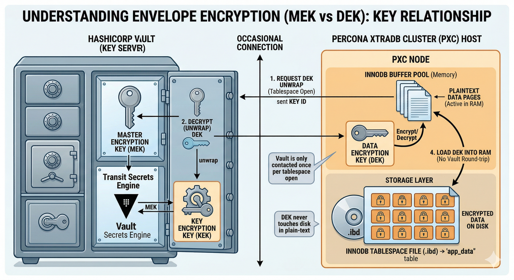

# Encrypt data for the first time

Use this how-to when you add data at rest encryption to an existing Percona XtraDB Cluster (PXC) cluster. The steps cover keyring setup, restart, and your first encrypted table.

These steps assume a multi-node PXC cluster. For a single Percona Server for MySQL instance, see [Percona Server for MySQL: InnoDB data encryption :octicons-link-external-16:](https://docs.percona.com/percona-server/{{vers}}/data-at-rest-encryption.html).

For rotation, backups, Vault operations, and disaster recovery, see [Operate encrypted PXC clusters](operate-encrypted-pxc-clusters.md).

## Prerequisites

Before you start, confirm the following:

* A healthy PXC cluster runs Percona XtraDB Cluster {{vers}} on every node.

* You can edit `my.cnf` (or an included option file) and restart `mysqld` on each node.

* You can connect with a MySQL account that has `CREATE` privilege and can run `SHOW COMPONENTS`.

* All cluster nodes will use the same keyring component type. PXC does not support mixed encrypted and unencrypted nodes in one cluster.

## Core concepts

A keyring stores encryption keys outside table data. InnoDB uses a master key from the keyring to protect tablespace keys. Tablespace keys encrypt data pages on disk.



A manifest file tells `mysqld` which keyring component to load at startup. Without a loaded keyring, encrypted tables cannot open.

## Choose a keyring

| Keyring | Best for | Notes |
| --- | --- | --- |
| `component_keyring_file` | Development, test, or simple lab clusters | Keys live in a local file on each node. Do not use for regulatory compliance. |
| `component_keyring_vault` | Production or centralized key management | Keys live in HashiCorp Vault. Requires network access to Vault and token automation for production. |

Pick one path in the following section. Configure the same keyring type on every node before you create encrypted objects.

## Configure the keyring on every node

Repeat the steps for your chosen keyring on each cluster member. Use the same paths and options on all nodes unless the main reference documents a deliberate per-node difference (for example, separate Vault mount paths).

### Path A: File keyring

1. Create a manifest file named `mysqld.my` in the MySQL installation directory:

```{.text .no-copy}
{
 "read_local_manifest": false,
 "components": "file://component_keyring_file"
}
```

2. Add the keyring path to `my.cnf`:

```{.text .no-copy}
[mysqld]
component_keyring_file_data=<PATH>/keyring
```

Replace `<PATH>` with a directory outside the data directory. Restrict file permissions to the `mysql` OS user.

3. Restart `mysqld` on the node.

4. Confirm the component loaded:

```sql
SHOW COMPONENTS;
```

??? example "Expected output"

    ```{.text .no-copy}
    +----------------------------------------+
    | Component_id                           |
    +----------------------------------------+
    | file://component_keyring_file          |
    +----------------------------------------+
    ```

Full file keyring reference: [Use the component_keyring_file](data-at-rest-encryption.md#use-the-component_keyring_file).

### Path B: Vault keyring

1. Ensure the PXC node can reach your Vault server over the network. For production, plan Vault Agent or another token renewal method before you rely on this cluster. See [Authentication lifecycle](data-at-rest-encryption.md#authentication-lifecycle).

2. Create a manifest file named `mysqld.my` in the MySQL installation directory:

```{.text .no-copy}
{
 "read_local_manifest": false,
 "components": "file://component_keyring_vault"
}
```

3. Create `component_keyring_vault.cnf` in JSON format. Adjust `vault_url`, `secret_mount_point`, and paths for your site:

```{.text .no-copy}
{
 "timeout": 15,
 "vault_url": "https://vault.example.com:8200",
 "secret_mount_point": "secret",
 "secret_mount_point_version": "AUTO",
 "token": "<VAULT_TOKEN>",
 "vault_ca": "/etc/mysql/vault-ca.pem"
}
```

Each `mysqld` instance needs its own `secret_mount_point` namespace. Do not point two servers at the same mount point.

4. Restart `mysqld` on the node.

5. Confirm the component loaded:

```sql
SHOW COMPONENTS;
```

??? example "Expected output"

    ```{.text .no-copy}
    +----------------------------------------+
    | Component_id                           |
    +----------------------------------------+
    | file://component_keyring_vault         |
    +----------------------------------------+
    ```

Full Vault keyring reference: [Configure PXC to use component_keyring_vault component](data-at-rest-encryption.md#configure-pxc-to-use-component_keyring_vault-component).

## Create your first encrypted table

After every node loads the keyring and rejoins the cluster, create an encrypted table on any member:

```sql
CREATE SCHEMA IF NOT EXISTS app_data;
CREATE TABLE app_data.secrets (
  id INT PRIMARY KEY,
  payload VARCHAR(255)
) ENCRYPTION='Y';
```

??? example "Expected outcome (client)"

    ```{.text .no-copy}
    Query OK, 1 row affected (0.01 sec)
    Query OK, 0 rows affected (0.05 sec)
    ```

Insert a row and read it back:

```sql
INSERT INTO app_data.secrets (id, payload) VALUES (1, 'test');
SELECT * FROM app_data.secrets;
```

??? example "Expected outcome (client)"

    ```{.text .no-copy}
    Query OK, 1 row affected (0.00 sec)
    +----+---------+
    | id | payload |
    +----+---------+
    |  1 | test    |
    +----+---------+
    1 row in set (0.00 sec)
    ```

Galera replicates the DDL and data to other members. On another node, run the same `SELECT` to confirm the table is readable cluster-wide.

Optional: inspect keyring status:

```sql
SELECT * FROM performance_schema.keyring_component_status;
```

??? example "Expected outcome (excerpt)"

    ```{.text .no-copy}
    +---------------------+------------------------------------------+
    | STATUS_KEY          | STATUS_VALUE                             |
    +---------------------+------------------------------------------+
    | Component_name      | component_keyring_file                   |
    | Component_status    | Active                                   |
    ...
    +---------------------+------------------------------------------+
    ```

The `Component_name` value matches your keyring type (`component_keyring_file` or `component_keyring_vault`).

## Verify the cluster

On each node, confirm the keyring component is active and encrypted tables open without errors in the MySQL error log.

Check cluster health:

```sql
SHOW STATUS LIKE 'wsrep_cluster_status';
SHOW STATUS LIKE 'wsrep_cluster_size';
```

??? example "Expected outcome (healthy cluster, illustrative)"

    ```{.text .no-copy}
    +----------------------+---------+
    | Variable_name        | Value   |
    +----------------------+---------+
    | wsrep_cluster_status | Primary |
    +----------------------+---------+
    +----------------------+-------+
    | Variable_name        | Value |
    +----------------------+-------+
    | wsrep_cluster_size   | 3     |
    +----------------------+-------+
    ```

Exact values depend on your topology.

## Next steps

| Topic | Where to read |
| --- | --- |
| InnoDB master key rotation | [Rotate the InnoDB master key](operate-encrypted-pxc-clusters.md#rotate-the-innodb-master-key) |
| Encrypted backups | [Backups and restore for encrypted clusters](operate-encrypted-pxc-clusters.md#backups-and-restore-for-encrypted-clusters) |
| Vault token renewal and AppRole | [Vault keyring operations](operate-encrypted-pxc-clusters.md#vault-keyring-operations) |
| SST with encryption | [SST configuration and the `[sst]` section](operate-encrypted-pxc-clusters.md#sst-configuration-and-the-sst-section) |
| Compliance evidence | [Compliance and audit evidence](data-at-rest-encryption.md#compliance-and-audit-evidence) |

!!! admonition "See also"

    [Data at rest encryption](data-at-rest-encryption.md)

    [Operate encrypted PXC clusters](operate-encrypted-pxc-clusters.md)

    [Encrypt traffic documentation](encrypt-traffic.md)

    [Percona Server for MySQL: InnoDB data encryption :octicons-link-external-16:](https://docs.percona.com/percona-server/{{vers}}/data-at-rest-encryption.html)
